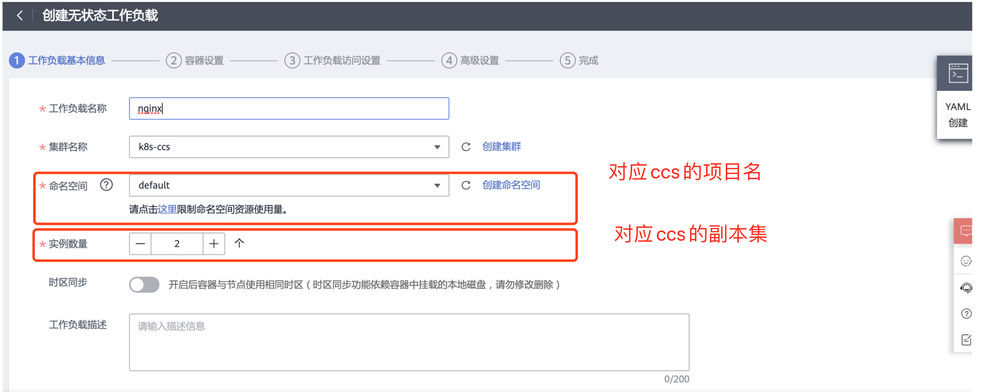
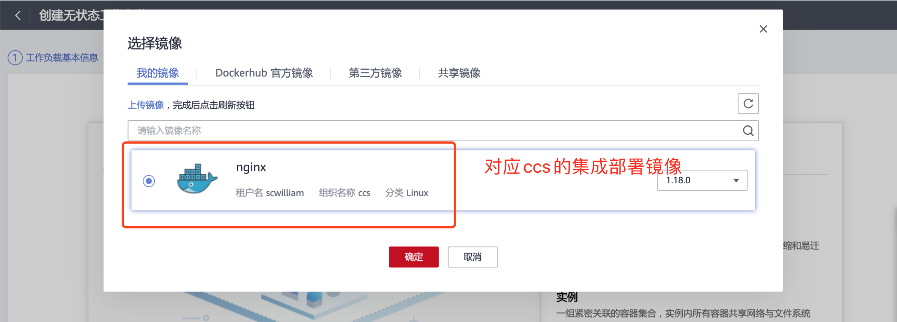
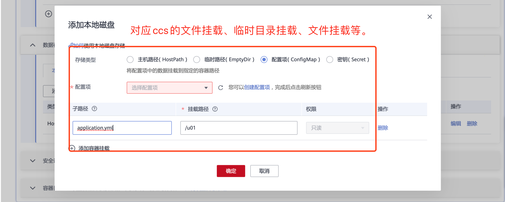
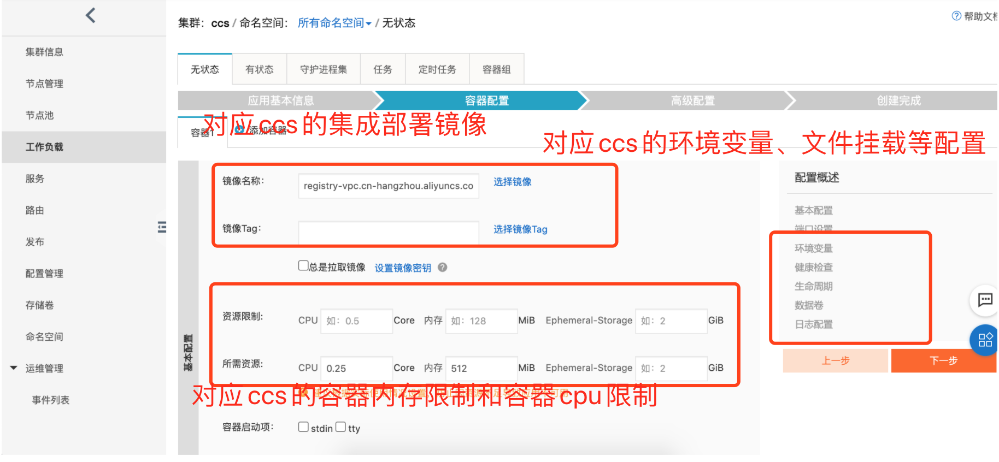
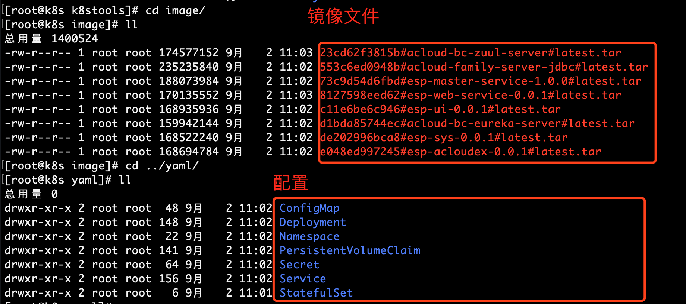
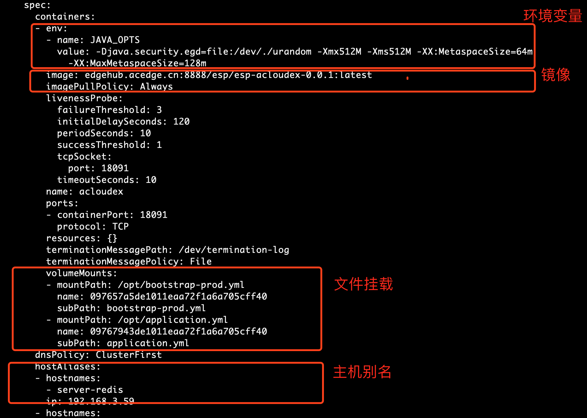
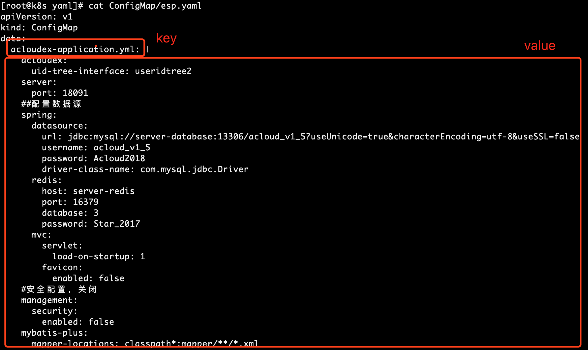

# 容器云项目配置导入（用acloudex举例）
## 1. 华为云项目配置导入。
### 1.1 容器云项目配置信息

### 2.1 对应的华为云项目配置信息

下图的configmap创建可以直接使用导出的configMap

### 3.1 对应的阿里云项目配置信息

### 4.1 工具导出ccs项目配置信息(提示都是对应的ccs里面的配置项)

acloudex.deployment.yaml

