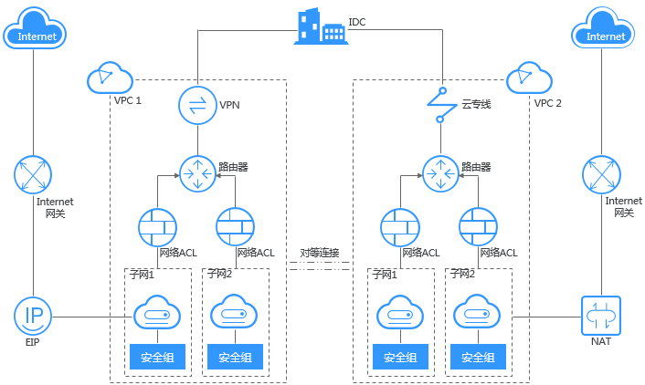
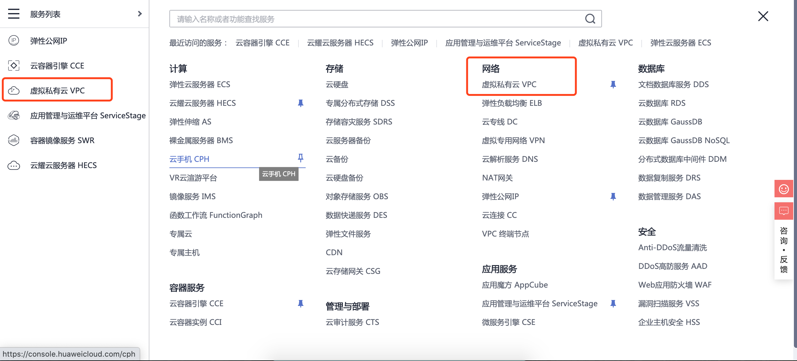
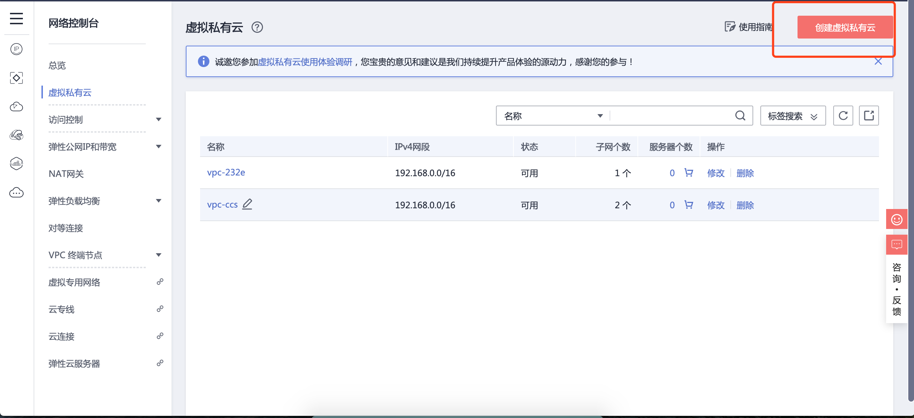

# 虚拟私有云
## 1. 能做什么
  - 虚拟私有云（Virtual Private Cloud，以下简称VPC），为云服务器、云容器、云数据库等资源构建隔离的、用户自主配置和管理的虚拟网络环境，提升用户云上资源的安全性，简化用户的网络部署。

## 2. 架构图
  
## 3. 步骤
  - 进入云平台，选择虚拟私有云
  
  - 进入网络控制台，创建虚拟私有云
  
  - 填写基本信息，创建申请
  
