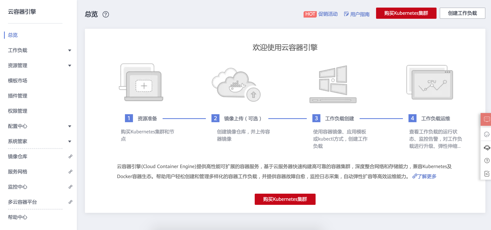
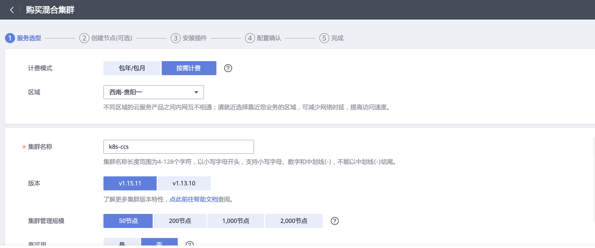
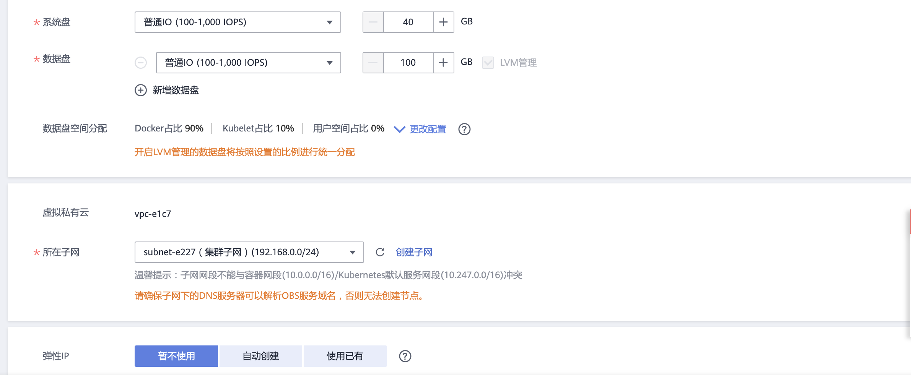
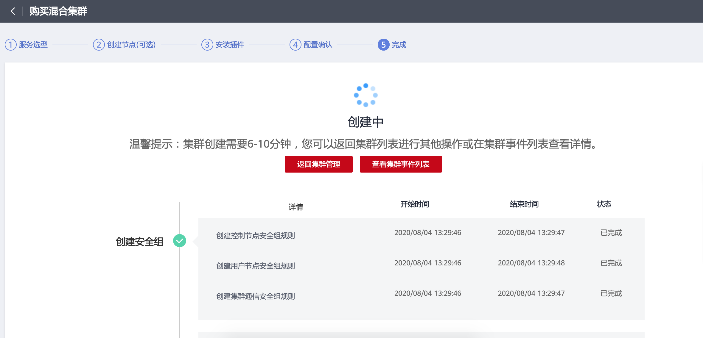
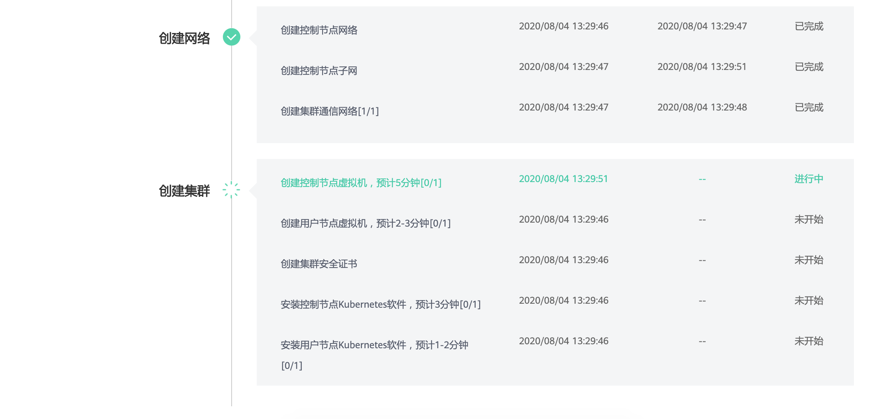

# 2.3.云容器引擎CCE（创建K8S集群）
## 1. 能做什么
  - 云容器引擎（Cloud Container Engine，简称CCE）提供高度可扩展的、高性能的企业级Kubernetes集群，支持运行Docker容器。借助云容器引擎，您可以在华为云上轻松部署、管理和扩展容器化应用程序。
  - 云容器引擎提供了Kubernetes集群管理、容器应用全生命周期管理、应用服务网格、Helm应用模板、插件管理、应用调度、监控与运维等容器全栈能力。

## 2. 架构图

## 3. 步骤
  - 进入云容器引擎，选择创建Kubernetes集群

  - 创建Kubernetes集群，选择k8s版本

  - 选择k8s节点配置

  - 选择节点系统盘和数据盘配置

  - 创建Kubernetes集群，执行状态

  - 创建Kubernetes集群，执行状态

  - 集群管理，查看集群状态

