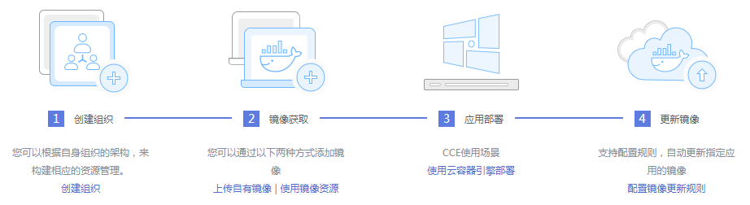
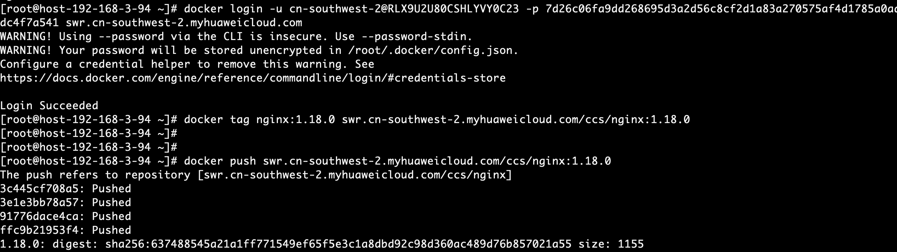
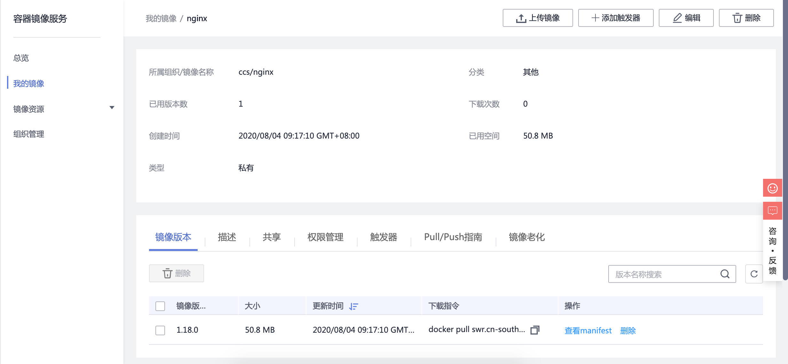
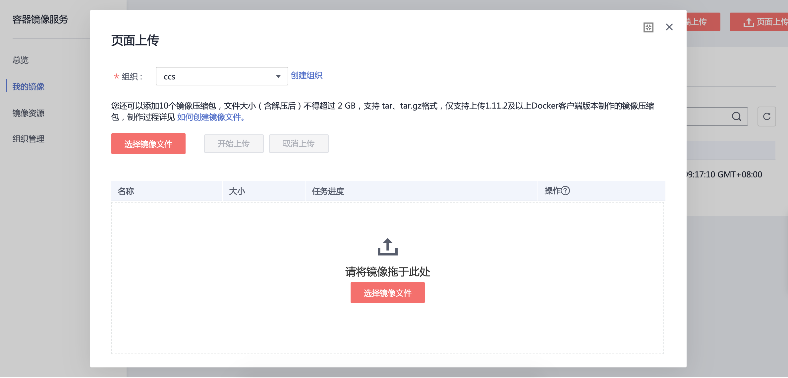

# 镜像上传
## 1. 能做什么
  - 容器镜像服务（Software Repository for Container，简称SWR）是一种支持镜像全生命周期管理的服务， 提供简单易用、安全可靠的镜像管理功能，帮助您快速部署容器化服务。您可以通过界面、Docker CLI和原生API上传、下载和管理Docker镜像。

## 2. 镜像服务流程图

## 3. 步骤
  - 进入容器镜像服务，选择总览
  
  - 选择组织管理，创建组织
  
  - 选择我的镜像，客户端上传
  
  客户端上传流程
  
  结果查询
  
  - 选择我的镜像，页面上传
  
