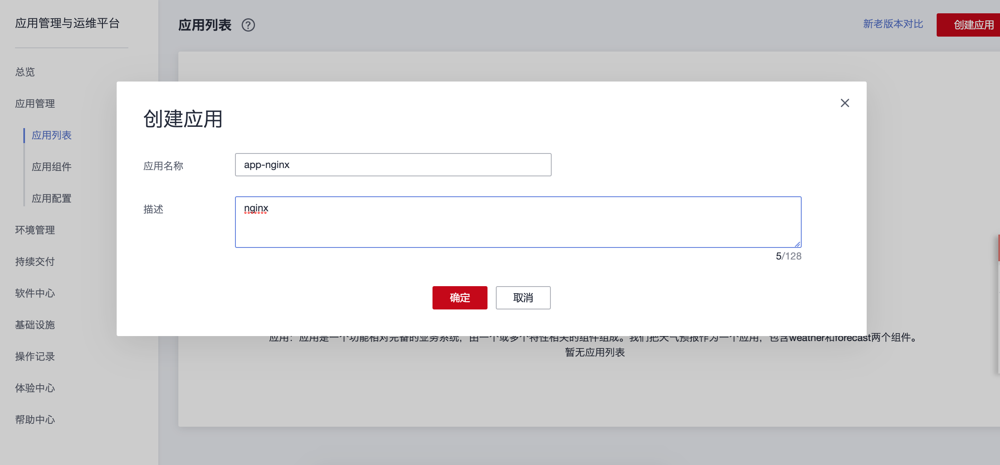
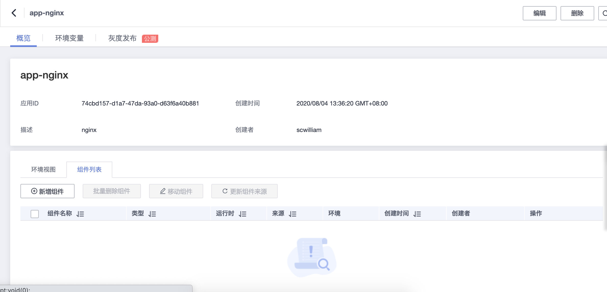
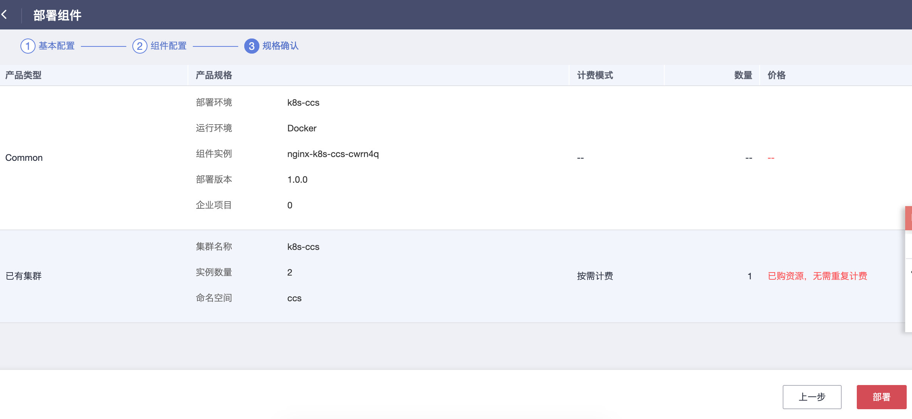
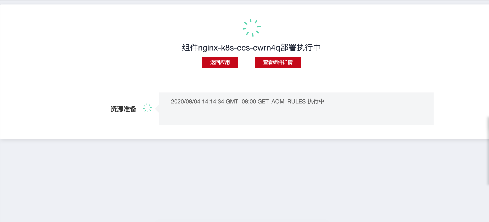
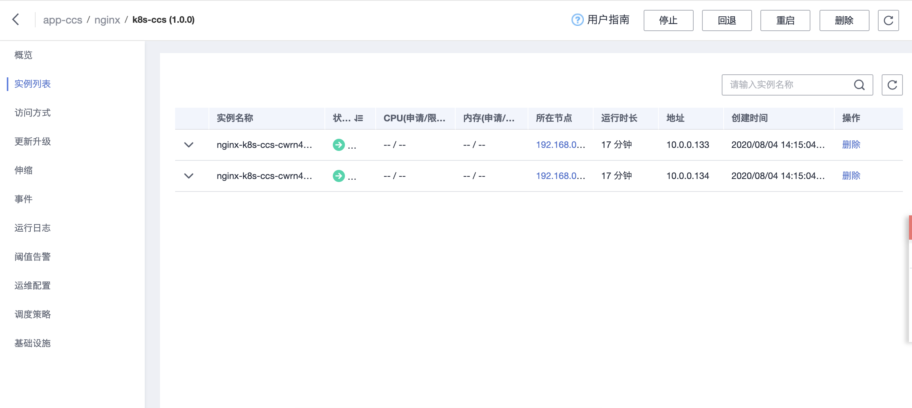
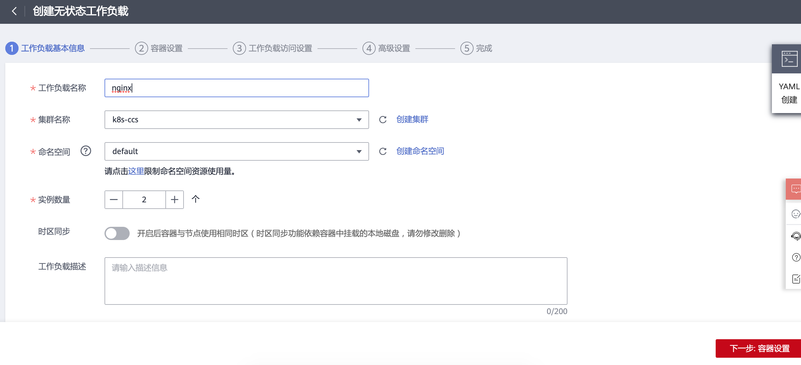
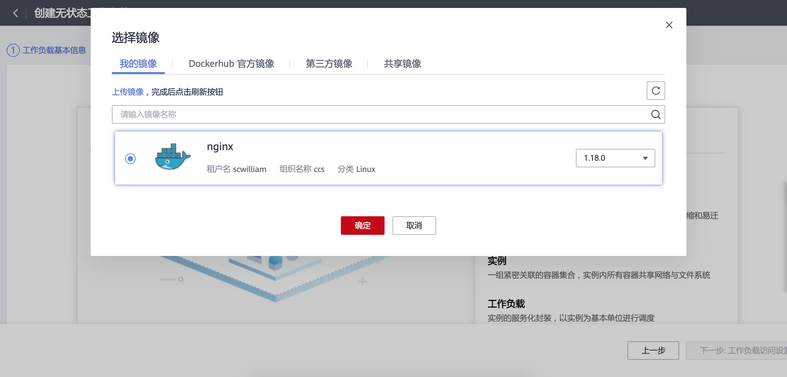
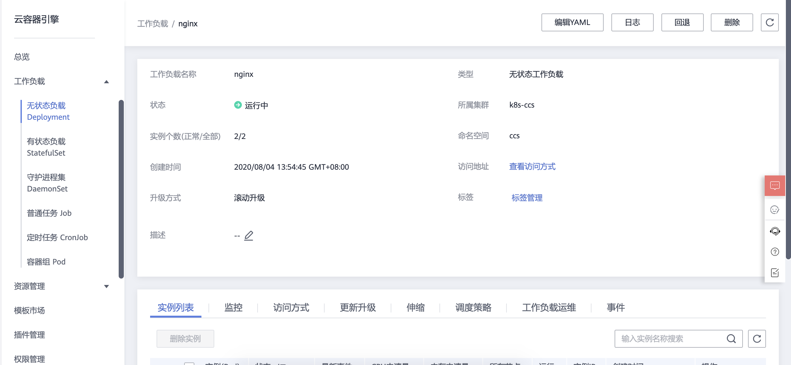
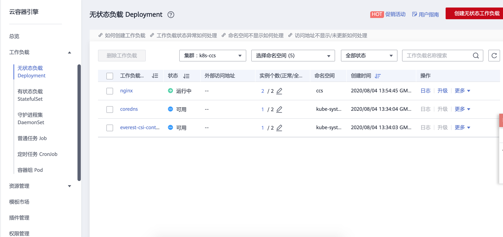

# 镜像部署
## 3.1. 能做什么
  - 应用管理与运维平台（ServiceStage）是一个应用托管和微服务管理平台，可以帮助企业简化部署、监控、运维和治理等应用生命周期管理工作。ServiceStage面向企业提供微服务、移动和Web类应用开发的全栈解决方案，帮助您的各类应用轻松上云，聚焦业务创新，帮助企业数字化快速转型。

## 3.2. 产品功能

#3.3 应用部署方式
## 3.3.1 方式一、创建应用
  - 进入应用管理与运维平台，选择应用列表

  - 创建应用

  - 创建应用，新增组件

  - 新增组件，选择通用模版

  - （通用模版）提供多语言（Java，PHP，Python等）、多运行环境的部署能力，开放定制，您可以灵活地搭建自己的应用组件。

  - 选择K8S集群

  - 选择上传的镜像

  - 部署

  - 部署状态

  -  部署日志

  -  实例列表

## 3.3.2 方式二、创建应用
  -  进入云容器引擎，创建无状态工作负载

  -  选择上传的镜像

  -  CPU，内存等基础设置

  -  文件挂载

  -  configmap文件挂载

  -  添加服务

  -  应用升级策略

  -  实例列表

  -  访问方式

  -  deployment清单

