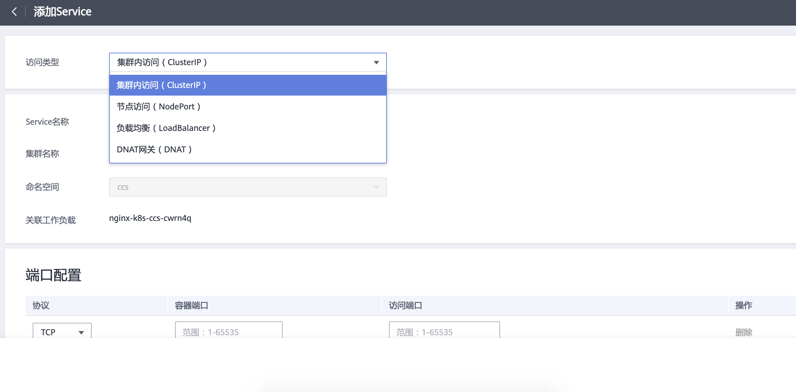
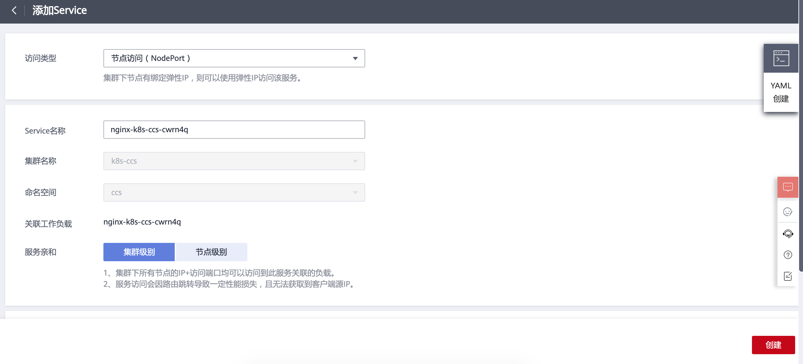
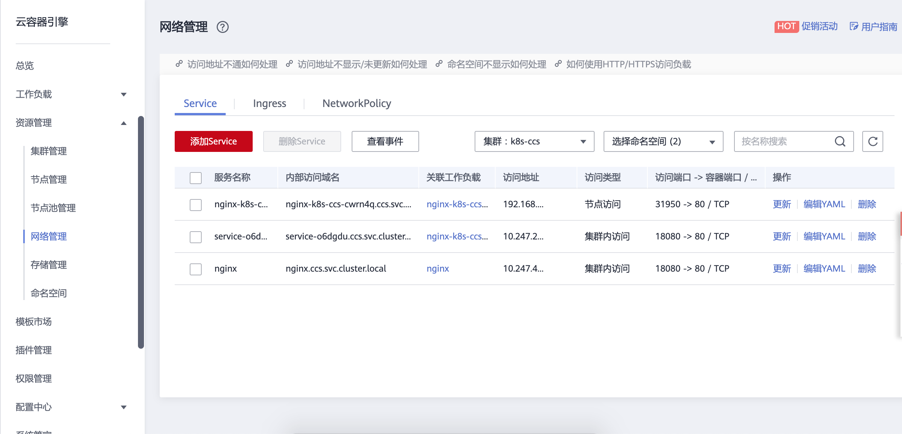

# 访问方式
##3.3.1 能做什么
云容器引擎通过将Kubernetes网络和VPC的深度集成，提供了稳定高性能的容器网络。在容器服务中，支持以下类型的互联互通。
 - 集群内访问（ClusterIP）
 - 节点访问（NodePort）
 节点访问 ( NodePort )是指在每个节点的IP上开放一个静态端口，通过静态端口对外暴露服务。
 - 负载均衡 ( LoadBalancer )
   通过弹性负载均衡从公网访问工作负载，与弹性IP方式相比提供了高可靠的保障，一般用于系统中需要暴露到公网的服务。
 - DNAT网关 ( DNAT )

##3.3.2 创建无状态工作负载

  - 添加Service

  - 添加Service

  - 选择节点端口

  - 服务清单

