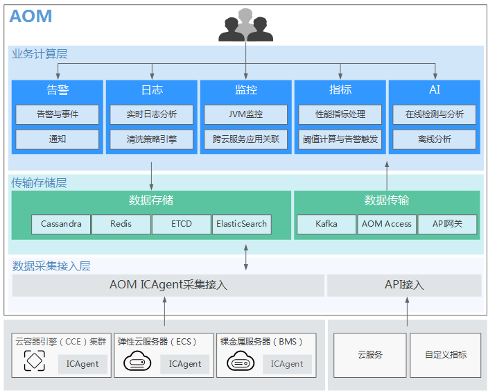

# 4.应用运维管理（监控）
## 1. 能做什么
应用运维管理（Application Operations Management，简称AOM）是云上应用的一站式立体化运维管理平台，实时监控您的应用及相关云资源，分析应用健康状态，提供灵活丰富的数据可视化功能，帮助您及时发现故障，全面掌握应用、资源及业务的实时运行状况。

## 2. 架构图

## 3. 监控
 - 总览

 - 事件

 - 应用实例

