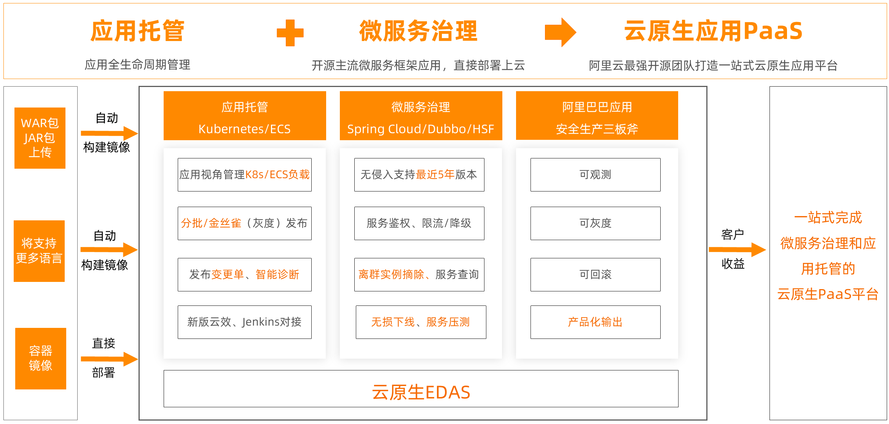

# 1.阿里云概念
  -  企业级分布式应用服务EDAS（Enterprise Distributed Application Service）是一个应用托管和微服务管理的云原生PaaS平台，提供应用开发、部署、监控、运维等全栈式解决方案，同时支持Spring Cloud和Apache Dubbo（以下简称Dubbo）等微服务运行环境，助力您的应用轻松上云。
# 2.阿里云架构

# 3.容器托管解决方案
  - EDAS支持以容器的形式托管应用，无缝对接容器服务Kubernetes，您无需理解容器服务底层细节。通过EDAS控制台就能完成应用在容器里的全生命周期管理，包括监控，诊断等服务。您可以低门槛拥抱容器新技术，最大化利用资源。

    - 无缝支持Kubernetes：Kubernetes集群托管给EDAS，您仅需关注应用生命周期管理即可。
    - 容器与微服务完美结合：基于Kubernetes，快速构建容器上的微服务架构。
    - 无需构建镜像：支持WAR包和JAR包直接部署，EDAS代为构建镜像并部署到Kubernetes集群，有效简化流程降低使用门槛。

