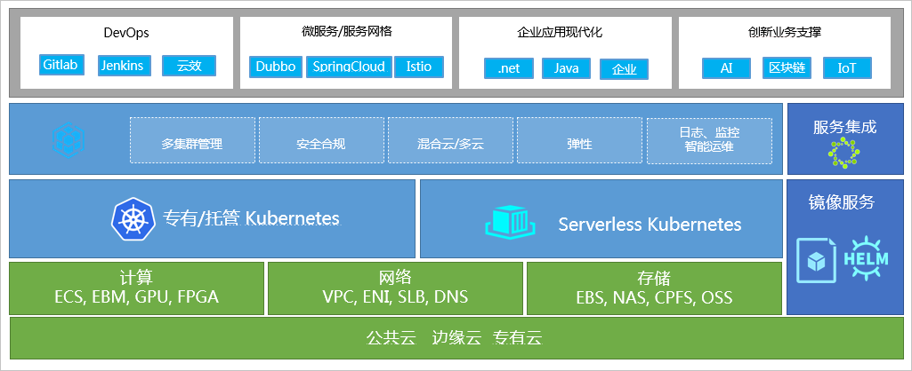
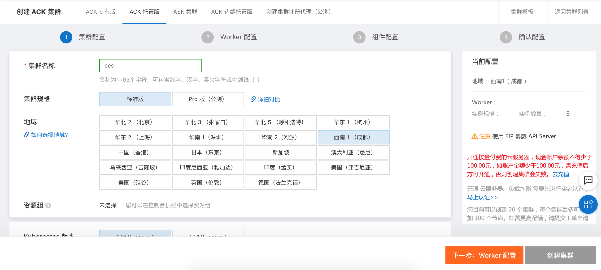
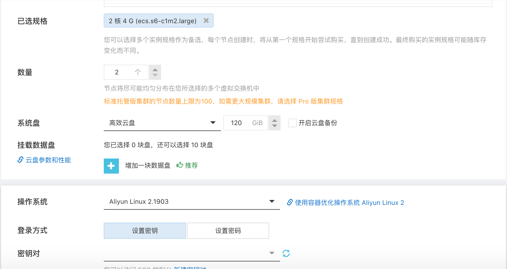

# 6.1.容器服务Kubernetes版（创建k8s集群）
## 1. 能做什么
  - 容器服务 Kubernetes 版基于原生 Kubernetes 进行适配和增强，简化集群的搭建和扩容等工作，整合阿里云虚拟化、存储、网络和安全能力，打造云端最佳的 Kubernetes 容器化应用运行环境。

## 2. 架构图

## 3. 步骤
  - 进入容器服务，选择创建集群
  
  - 选择创建ACK托管集群
  
  - 填入节点信息，选择创建集群
  
  - 确认节点信息，创建集群
  
  - 集群创建中
  
