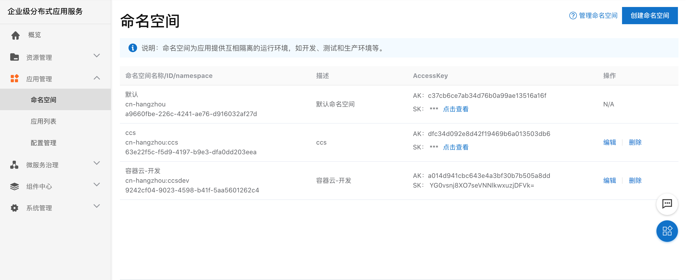

# 6.2.创建命名空间
## 1. 能做什么
  - 命名空间为应用提供互相隔离的运行环境，如开发、测试和生产环境等，您可以使用命名空间实现资源和服务的隔离。在同一个地域内不允许创建两个同名的命名空间。

## 2. 步骤
  - 进入企业级分布式应用服务，选择应用管理-命名空间，创建命名空间

  - 查询已创建的命名空间

  - 网省差异，里面有个租户的概念，这里框起来的TID是namespace的ID，AK是 access-key，SK是secret-key将这三个数据保存下来，以后配置nacos注册中心的时候要用到

