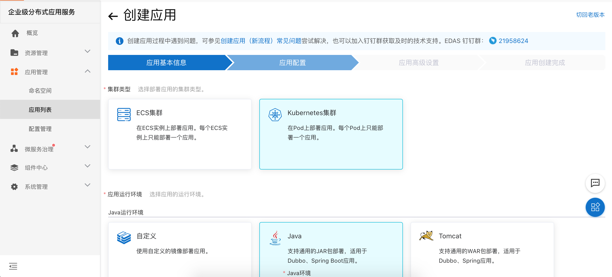
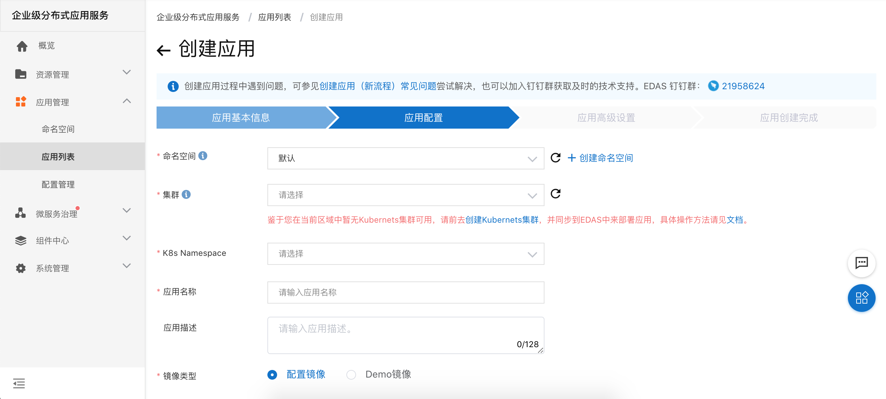
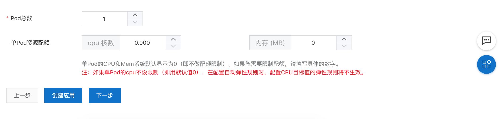
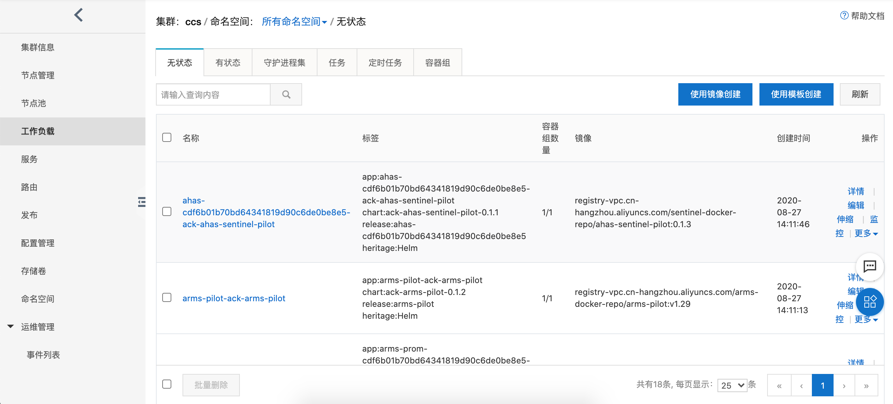
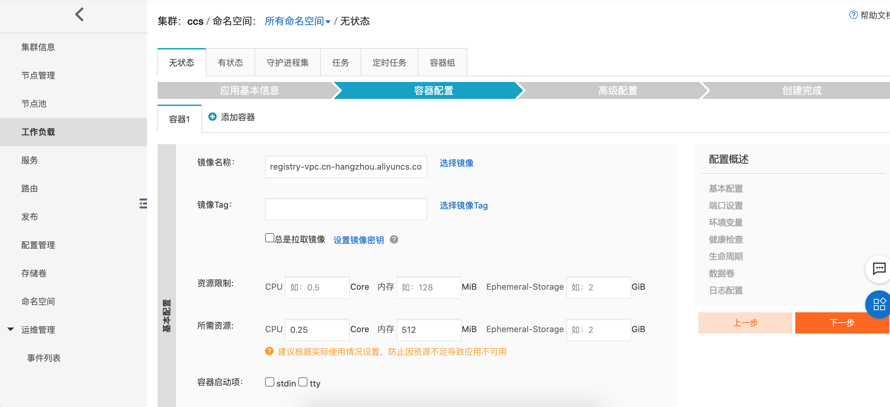

# 7.2.应用创建
- 1.进入企业级分布式应用服务，选择应用管理->应用列表->创建应用

- 2.选择命名空间，集群，填写应用名

- 3.选择上传的镜像，或者jar/war包。

- 4.设置容器总数，容器的cpu和内存配置。创建应用

- 5.demo应用详情。

- 6.集群下面使用镜像创建。

- 7.集群下面使用镜像创建。设置内存，CPU等

- 8.登录到已部署到容器。

- 10.应用基本信息。

