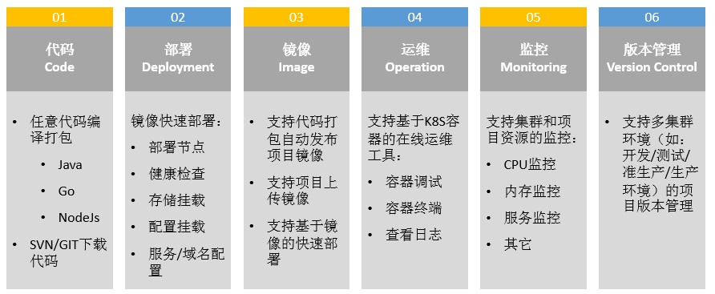
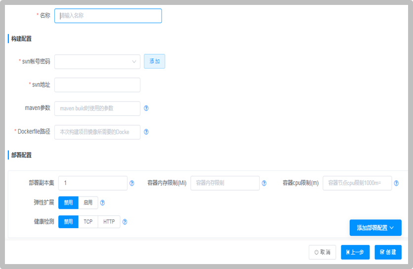
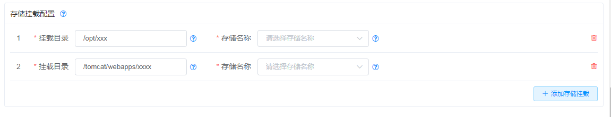
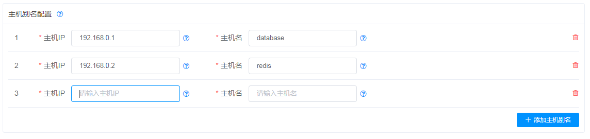

# 容器云平台架构能做什么

## 1. 基于容器的持续集成

## 2. 简化K8S部署
- 在一个界面中可以完成代码到k8s配置部署的所有工作

### 2.1 部署基本配置

#### 2.1.1 配置部署副本集数量
表示部署的副本集数量:
- 容器云平台通过Kubernetes中的Deployment资源来部署容器
这里的[部署副本数]与Deployment资源中的Replicas属性对应（表示部署的Pod数量）
- 通过容器云平台部署的Deployment资源中，一个Pod只有一个容器（与每个任务中配置或构建的镜像对应）。
#### 2.1.2 配置内存和CPU资源限制
##### 2.1.2.1 内存限制
表示容器运行的最大内存限制:
- 容器内存限制的单位为兆（M），如果配置为1024，表示容器的最大内存为1024M
- 如果配置为空，表示不对容器的做内存限制
- 容器的最大内存与容器中运行的程序有关，比如jkd7的tomcat容器中配置的JVM参数为[-Xmx1024M -XX:MaxPermSize=512M -Xss256k]，则可以预估该容器的最大内存为1736M（1024M堆区内存 + 512M方法区内存 + 200M预估的栈区内存）
##### 2.1.2.2 CPU限制
表示容器运行的最大CPU限制:
容器内存限制的单位为（m），1核=1000M（如果配置为100，表示容器的最大CPU为0.1核）
如果配置为空，表示不对容器的做CPU限制
容器的最大CPU与容器中运行的程序有关，比如预估某个tomcat容器的峰值CPU为200%，则可以设置CPU限制为2000
#### 2.1.3 配置弹性扩展
配置弹性扩展是否启用，如果配置为启用，则CPU达到阀值后，将自动扩展部署副本集
#### 2.1.4 配置健康检查
配置是否启用容器的监控检测，如果开启健康检测，且检测到容器的TCP/HTTP服务不可用，将自动重启容器:
- 禁用：表示不做监控检测
- TCP：表示通过TCP端口探测的方式检测容器是否正常（如果TCP端口连接正常，表示容器正常，否则表示容器异常）
- HTTP：表示通过HTTP请求的方式，探测的方式检测容器是否正常（如果HTTP Get返回200，表示容器正常，否则表示容器异常）

### 2.2 存储挂载

挂载NFS/CEPH等存储
### 2.3 文件挂载
- 文件挂载用于挂载容器中的程序运行所需要的某些配置文件（如容器中的SpringBoot启动需要的bootstrap.yml和application.yml）
- 文件挂载功能建配置文件存储在Kubernetes的ConfigMap中，以Volume的形式挂载为容器内部的文件。

### 2.4 环境变量

配置容器运行所需要的环境变量。
比如：通过LANG环境变量设置alpine/centos容器的语言；通过JAVA_OPTS设置tomcat容器的Java启动参数。

### 2.5 主机别名

配置容器中的/etc/hosts主机别名。请确保您的Pod所在的Kubernetes集群到目标主机的网络可达。

### 2.6 服务入口

配置容器提供的服务：
- **`目标端口`**：表示容器内部的端口（比如：tomcat容器的8080端口）
- **`集群端口`**：表示Kubernetes中的ClusterIP端口，该端口在Kubernetes集群内部可以访问，通过"任务名:集群端口"的方式访问（比如：user任务部署中定义了一个18080集群端口，对应的目标端口为8080，则其他Pod可以通过user:18080访问user任务的8080端口）
- **`节点端口`**：表示Kubernetes中的NodePort端口。通过设置节点端口，可以将目标端口映射到Kubernetes集群中的每台物理节点。可以在Kubernetes集群外部通过集群中任意物理节点的IP+节点端口访问。
- **`访问域名`**：表示Kubernetes中的Ingress服务。通过设置访问域名，可以将目标端口配置到Kubernetes集群中每个节点的软负载均衡（将配置的域名解析到任意Kubernetes节点后，就可以通过域名的方式访问对应的目标端口服务）

### 2.7 任务的安装/重启/卸载/删除
- **`安装`**：构建（编译java/go/js等代码，并打成docker镜像）并部署容器
- **`重启`**：仅部署容器
- **`卸载`**：卸载已部署的容器
- **`删除`**：删除配置的任务，并卸载已部署的容器

## 3. 自定义任务模板

- 集成部署模板

## 4. 应用商店

## 5. 多租户多k8s集群管理

## 6. 版本管理

