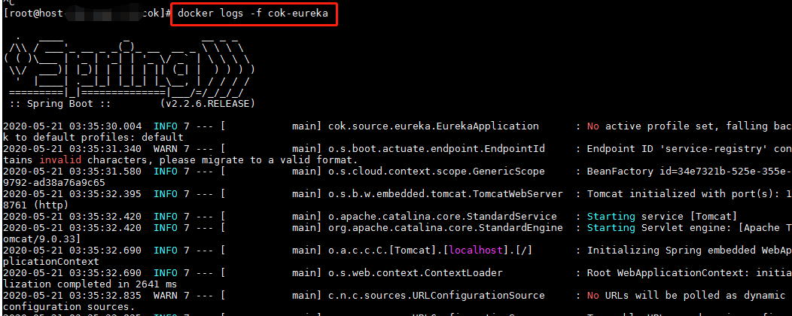
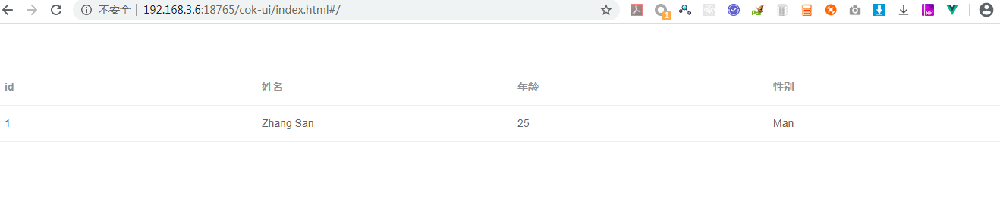

# 部署在docker中

## 0. 环境准备：
- 服务器操作系统：建议CentOS 7 以上（Windows环境理论上也可以，未测试）
- 确保服务器能够从公网下载docker镜像，以及能够从公网maven仓库拉取依赖jar包
- 安装了docker：建议docker v18.09.5
- 安装了GIT
- 安装了JDK：需要JDK 8或以上版本
- 安装了MAVEN
- 安装了NPM打包工具
- 下载测试源代码：
```shell
git clone https://gitee.com/olivee/cok.git
```

## 1. 如果全部以jar方式部署，参考如下流程说明

### 1.1 打包镜像文件

打包脚本参考源代码中的 `build-in-java.sh`

```shell
# 打包前端代码
cd cok-source-vue
npm install
if [ "$?" -ne 0 ]; then echo "npm install package failed"; exit 1; fi
npm run build
if [ "$?" -ne 0 ]; then echo "npm run build failed"; exit 1; fi

# 拷贝前端代码到cok-source-java-ui项目的static目录
cd ..
rm -rf cok-source-java/cok-source-java-ui/src/main/resources/static
cp -R cok-source-vue/dist cok-source-java/cok-source-java-ui/src/main/resources/static

# maven打包java程序
cd cok-source-java
mvn package
if [ "$?" -ne 0 ]; then echo "maven build failed"; exit 1; fi

# 打包dockerfile
cd cok-source-java-eureka
docker build -t cok-source-java-eureka:v0.0.1 .
if [ "$?" -ne 0 ]; then echo "docker build eureka failed"; exit 1; fi

cd ../cok-source-java-zuul
docker build -t cok-source-java-zuul:v0.0.1 .
if [ "$?" -ne 0 ]; then echo "docker build zuul failed"; exit 1; fi

cd ../cok-source-java-service1
docker build -t cok-source-java-service1:v0.0.1 .
if [ "$?" -ne 0 ]; then echo "docker build service1 failed"; exit 1; fi

cd ../cok-source-java-ui
docker build -t cok-source-java-ui:v0.0.1 .
if [ "$?" -ne 0 ]; then echo "docker build ui failed"; exit 1; fi
```

查看已打好的镜像
```shell
[root@xxx cok]# docker images|grep cok
cok-source-java-service1                                                                   v0.0.1                         bae8db875a82        11 days ago         171MB
cok-source-java-ui                                                                         v0.0.1                         a4568cb0faee        12 days ago         152MB
cok-source-java-zuul                                                                       v0.0.1                         897d8794f353        12 days ago         151MB
cok-source-java-eureka                                                                     v0.0.1                         67f3bf22d247        12 days ago         154MB
```

### 1.2 启动容器

- 注意：<font color=red>每个服务启动后，需要等容器内部的服务启动成功完成后，再启动后续的服务</font>
- 通过`docker logs -f 容器名`查看容器的日志，如果`docker logs -f cok-eureka`查看`cok-eureka`容器的日志

查看容器日志截图：


#### 1.2.1 启动 cok-mysql 容器
这里先启动一个临时的mysql，由于只是临时用，因此没加存储。容器销毁后数据会丢失。（测试或生产环境不要以以下方式启动mysql，需要改为挂存储启动）
```shell
docker run --name cok-mysql  --restart=always  -p 25306:3306 -e MYSQL_ROOT_PASSWORD=123456 -d mysql:5.7.30
```
可以用服务器的IP、25306、root账号、密码123456，连接mysql，测试mysql是否正常启动

#### 1.2.2 启动 cok-eureka 容器

```shell
docker run --name cok-eureka -d --network=host cok-source-java-eureka:v0.0.1
```

注意： 该容器默认启动的是`18761`端口


#### 1.2.3 启动 cok-zuul 容器

```shell
docker run --name cok-zuul -d --network=host cok-source-java-zuul:v0.0.1
```

注意： 该服务默认启动的是`18762`端口

#### 1.2.4 启动 cok-service1 容器

```shell
docker run --name cok-service1 -d --network=host -e MYSQL_HOST=127.0.0.1 -e MYSQL_PORT=25306 -e MYSQL_DATABASE=mysql -e MYSQL_USER=root -e MYSQL_PASSWORD=123456 cok-source-java-service1:v0.0.1
```
- 这里启动service1服务器，服务配置连接到刚才启动的临时mysql（也可以连接到已有的其它mysql服务，修改连接参数即可）

#### 1.2.5 启动 cok-java-ui 容器

```shell
docker run --name cok-java-ui -d --network=host cok-source-java-ui:v0.0.1
```

### 1.3 测试服务

- 测试访问eureka服务,通过`http://ip地址:18761/`访问，如：
[http://192.168.3.6:18761/](http://192.168.3.6:18761/)


- 访问java-ui服务,通过`http://ip地址:18762/cok-ui/index.html`访问，如：[http://192.168.3.6:18762/cok-ui/index.html](http://192.168.3.6:18762/cok-ui/index.html)


## 2. 如果eureka、zuul、service1以jar方式部署，ui以nginx方式部署，参考如下流程说明
### 2.1 打包镜像文件
打包脚本参考源代码中的 `build-in-nginx.sh`
```shell
# 打包前端代码
cd cok-source-vue
npm install
if [ "$?" -ne 0 ]; then echo "npm install package failed"; exit 1; fi
npm run build
if [ "$?" -ne 0 ]; then echo "npm run build failed"; exit 1; fi

# 打包vue dockerfile
docker build -t cok-source-vue:v0.0.1 .
if [ "$?" -ne 0 ]; then echo "docker build vue failed"; exit 1; fi

# maven打包java程序
cd ../cok-source-java
mvn package
if [ "$?" -ne 0 ]; then echo "maven build failed"; exit 1; fi

# 打包dockerfile
cd cok-source-java-eureka
docker build -t cok-source-java-eureka:v0.0.1 .
if [ "$?" -ne 0 ]; then echo "docker build eureka failed"; exit 1; fi

cd ../cok-source-java-zuul
docker build -t cok-source-java-zuul:v0.0.1 .
if [ "$?" -ne 0 ]; then echo "docker build zuul failed"; exit 1; fi

cd ../cok-source-java-service1
docker build -t cok-source-java-service1:v0.0.1 .
if [ "$?" -ne 0 ]; then echo "docker build service1 failed"; exit 1; fi
```

### 2.2 启动容器

#### 2.2.1 启动 cok-mysql、cok-eureka、cok-zuul、cok-service1容器
启动方式和`1.2.1 启动 cok-mysql 容器`、`1.2.2 启动 cok-eureka 容器`、`1.2.3 启动 cok-zuul 容器`、`1.2.4 启动 cok-service1 容器`一致，可以参考前面的文档

注意：cok-mysql、cok-eureka、cok-zuul、cok-service1服务在一个服务器上<font color=red>只能启动一次</font>，有用我们的容器是以host网络（`--network=host`）的方式启动的，因此如果同一个镜像启动两次，后启动的容器会由于端口冲突而启动失败

####2.2.1 启动 cok-vue-ui 服务

```shell
docker run --name cok-vue-ui -d -p 18765:80 cok-source-vue:v0.0.1
```

### 2.3 测试服务
- 访问java-ui服务,通过`http://ip地址:18765/cok-ui/index.html`访问，如：[http://192.168.3.6:18765/cok-ui/index.html](http://192.168.3.6:18765/cok-ui/index.html)



## 3. 两种方式区别

### 全部以jar方式部署：
- ui打包在一个微服务中，通过zuul网关访问前端页面

### eureka、zuul、service1以jar方式部署，ui以nginx方式部署：
- ui打包到nginx中，通过nginx访问前端页面

## 4. 附录

### 附录4.1 如果需要停止容器
先执行docker stop，再执行docker rm，比如要停止并删除`cok-service1`容器，则执行如下命令：
```shell
docker stop cok-service1
docker rm cok-service1
```

### 附录4.2 如果需要给容器挂载文件或目录
在`docker run`命令启动参数中加入`-v`参数，并制定挂载的文件或目录，如下:
```shell
docker run -v /opt/mysql/data:/var/lib/mysql -v /opt/mysql/my.cnf:/etc/mysql/conf.d/my-project.cnf -p 25306:3306 -e MYSQL_ROOT_PASSWORD=123456 -d mysql:5.7.30
```
- 以上命令挂载的本地的/opt/mysql/data目录到mysql容器的数据文件目录/var/lib/mysql（以实现mysql容器的持久化存储）
- 以上命令挂载的本地的/opt/mysql/my.cnf文件到mysql容器的配置文件/etc/mysql/conf.d/my-project.cnf（以实现mysql服务的参数配置）

### 附录4.3 docker以hosts网络的方式启动
在`docker run`命令启动参数中加入`--network=host`参数
- 如果不以hosts网络的方式启动，容器的网络将个服务器的网络隔离，容器与容器之间的网络也不通
- 这里我们用hosts网络只是为了测试方便（为了让eureka、zuul、service1能够直接通信），具体是否需要采用hosts网络要根据业务需求来定

### 附录4.4 容器的端口映射
在`docker run`命令启动参数中加入`-p`参数，比如
```shell
docker run --name cok-mysql  --restart=always  -p 25306:3306 -e MYSQL_ROOT_PASSWORD=123456 -d mysql:5.7.30
```
- 以上命令将docker容器中的3306端口映射到25306，这样就可以直接通过服务器的ip加25306端口访问mysql容器
