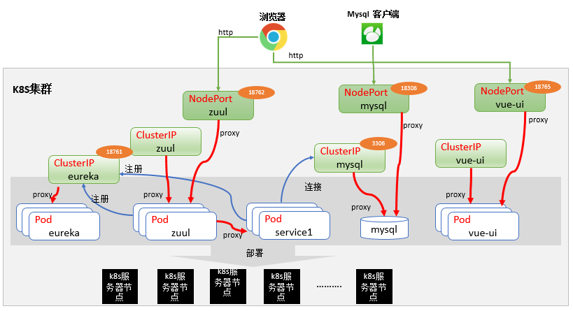

# 部署在k8s中

## 1. 部署脚本
参考 `deploy/deploy-on-k8s.sh` 中的脚本

```shell
# 将镜像打tag
docker tag cok-source-java-service1:v0.0.1 hub.aosccs.com.cn:8888/cokk8s/cok-source-java-service1:v0.0.1
docker tag cok-source-vue:v0.0.1           hub.aosccs.com.cn:8888/cokk8s/cok-source-vue:v0.0.1
docker tag cok-source-java-zuul:v0.0.1     hub.aosccs.com.cn:8888/cokk8s/cok-source-java-zuul:v0.0.1
docker tag cok-source-java-eureka:v0.0.1   hub.aosccs.com.cn:8888/cokk8s/cok-source-java-eureka:v0.0.1

# 推送到镜像仓库
docker login hub.aosccs.com.cn:8888
docker push hub.aosccs.com.cn:8888/cokk8s/cok-source-java-service1:v0.0.1
docker push hub.aosccs.com.cn:8888/cokk8s/cok-source-vue:v0.0.1
docker push hub.aosccs.com.cn:8888/cokk8s/cok-source-java-zuul:v0.0.1
docker push hub.aosccs.com.cn:8888/cokk8s/cok-source-java-eureka:v0.0.1


# 安装服务
kubectl create -f k8s-config/1.namespaces.yaml
kubectl create -f k8s-config/2.configmaps.yaml
kubectl create -f k8s-config/3.1.mysql-pvc.yaml
kubectl create -f k8s-config/3.2.mysql-deployment.yaml
kubectl create -f k8s-config/3.3.mysql-service.yaml
kubectl create -f k8s-config/4.1.eureka-deployment.yaml
kubectl create -f k8s-config/4.2.eureka-service.yaml
kubectl create -f k8s-config/5.1.zuul-deployment.yaml
kubectl create -f k8s-config/5.2.zuul-service.yaml
kubectl create -f k8s-config/6.service1-deployment.yaml
kubectl create -f k8s-config/7.1.vue-ui-deployment.yaml
kubectl create -f k8s-config/7.2.vue-ui-service.yaml
```

## 2. 部署配置文件讲解
### 2.1 `1.namespaces.yaml`配置文件说明
- 创建 `cokk8s` 命名空间（一般一个项目用一个命名空间）
```yml
apiVersion: v1
kind: Namespace
metadata:
  name: cokk8s
```

### 2.2 `2.configmaps.yaml`配置文件说明
- 配置中创建了一个名称为`cokk8s`的ConfigMap配置，配置中有一个Key ：`service-application.yml`
- 这个配置在后续的`6.service1-deployment.yaml`中会用到
- 配置中连接的数据为地址`mysql:3306`,表示连接本namespace（`cokk8s`）中的`mysql`服务的`3306`端口
```yml
apiVersion: v1
data:
  service-application.yml: |-
    server:
      port: 18763
    spring:
      datasource:
        max-idle: 8
        min-idle: 8
        max-active: 20
        driverClassName: com.mysql.cj.jdbc.Driver
        initial-size: 10
        type: com.alibaba.druid.pool.DruidDataSource
        url: jdbc:mysql://mysql:3306/mysql?characterEncoding=utf8&useSSL=false&allowMultiQueries=true
        username: root
        password: 123456
      jpa:
        show-sql: true
        database: mysql
        hibernate:
          ddl-auto: create
        database-platform: org.hibernate.dialect.MySQL5Dialect
kind: ConfigMap
metadata:
  name: cokk8s
  namespace: cokk8s
```
### 2.3 `3.1.mysql-pvc.yaml`配置文件说明
- 创建一个mysql的PersistentVolumeClaim（PVC），用于后续部署MySQL的时候（`3.2.mysql-deployment.yaml`），存储MySQL的数据文件
- 注意：我们这里用到了k8s中我们已经建好的storageClassName:`managed-nfs-storage`（如果你所在k8s集群中没有，需要手动创建）
```yml
apiVersion: v1
kind: PersistentVolumeClaim
metadata:
  annotations:
    volume.beta.kubernetes.io/storage-provisioner: fuseim.pri/ifs
  name: mysql
  namespace: cokk8s
spec:
  accessModes:
  - ReadWriteMany
  resources:
    requests:
      storage: 2Gi
  storageClassName: managed-nfs-storage
```
### 2.4 `3.2.mysql-deployment.yaml`配置文件说明
- 部署mysql，设置密码为`123456`,存储为上一步创建的pvc：`mysql`，存储挂载到`/var/lib/mysql`目录
```yml
apiVersion: apps/v1
kind: Deployment
metadata:
  labels:
    app: mysql
  name: mysql
  namespace: cokk8s
spec:
  replicas: 1
  selector:
    matchLabels:
      app: mysql
  template:
    metadata:
      labels:
        app: mysql
    spec:
      containers:
      - env:
        - name: MYSQL_ROOT_PASSWORD
          value: "123456"
        - name: MYSQL_PASSWORD
          value: "123456"
        name: mysql
        image: mysql:5.7.30
        imagePullPolicy: IfNotPresent
        livenessProbe:
          exec:
            command:
            - sh
            - -c
            - mysqladmin ping -u root -p${MYSQL_ROOT_PASSWORD}
          failureThreshold: 3
          initialDelaySeconds: 30
          periodSeconds: 10
          successThreshold: 1
          timeoutSeconds: 5
        ports:
        - containerPort: 3306
          name: mysql
          protocol: TCP
        readinessProbe:
          exec:
            command:
            - sh
            - -c
            - mysqladmin ping -u root -p${MYSQL_ROOT_PASSWORD}
          failureThreshold: 3
          initialDelaySeconds: 5
          periodSeconds: 10
          successThreshold: 1
          timeoutSeconds: 1
        resources:
          requests:
            cpu: 100m
            memory: 256Mi
        volumeMounts:
        - mountPath: /var/lib/mysql
          name: data
      initContainers:
      - command:
        - rm
        - -fr
        - /var/lib/mysql/lost+found
        name: remove-lost-found
        image: busybox:1.29.3
        imagePullPolicy: IfNotPresent
        resources:
          requests:
            cpu: 10m
            memory: 10Mi
        volumeMounts:
        - mountPath: /var/lib/mysql
          name: data
      restartPolicy: Always
      volumes:
      - name: data
        persistentVolumeClaim:
          claimName: mysql
```
### 2.5 `3.3.mysql-service.yaml`配置文件说明
- 暴露mysql的服务，服务名称为`mysql`,集群端口为`3306`,节点端口为`18306`
```yml
apiVersion: v1
kind: Service
metadata:
  labels:
    app: mysql
  name: mysql
  namespace: cokk8s
spec:
  selector:
    app: mysql
  type: NodePort
  ports:
  - name: mysql
    nodePort: 18306 #节点端口，可以k8s节点的ip加这个端口号可以访问
    port: 3306 #集群端口，在k8s集群内部可以直接访问，如mysql:3306
    protocol: TCP
    targetPort: mysql
```
### 2.6 `4.1.eureka-deployment.yaml`配置文件说明
- 部署cok-source-java-eureka镜像的Deployment，拉取镜像策略为`Always`,容器暴露端口为`18761`
```yml
apiVersion: apps/v1
kind: Deployment
metadata:
  labels:
    appname: eureka
  name: eureka
  namespace: cokk8s
spec:
  replicas: 1
  selector:
    matchLabels:
      appname: eureka
  template:
    metadata:
      labels:
        appname: eureka
    spec:
      containers:
      - image: hub.aosccs.com.cn:8888/cokk8s/cok-source-java-eureka:v0.0.1
        imagePullPolicy: Always
        name: eureka
        ports:
        - containerPort: 18761
          protocol: TCP
      restartPolicy: Always
```
### 2.7 `4.2.eureka-service.yaml`配置文件说明
- 定义cok-source-java-eureka暴露的服务`eureka`,目的是为了后面的zuul和service1可以通过`eureka:18761`连接eureka服务
```yml
apiVersion: v1
kind: Service
metadata:
  labels:
    appname: eureka
  name: eureka
  namespace: cokk8s
spec:
  selector:
    appname: eureka
  type: NodePort
  ports:
  - name: serice-0
    nodePort: 18761
    port: 18761
    protocol: TCP
    targetPort: 18761
```
### 2.8 `5.1.zuul-deployment.yaml`配置文件说明
- 定义部署zuul的Deployment，连接eureka的地址为`http://eureka:18761/eureka`,容器端口为`18762`
```yml
apiVersion: apps/v1
kind: Deployment
metadata:
  labels:
    appname: zuul
  name: zuul
  namespace: cokk8s
spec:
  replicas: 1
  selector:
    matchLabels:
      appname: zuul
  template:
    metadata:
      labels:
        appname: zuul
    spec:
      containers:
      - env:
        - name: EUREKA_URI
          value: http://eureka:18761/eureka
        image: hub.aosccs.com.cn:8888/cokk8s/cok-source-java-zuul:v0.0.1
        imagePullPolicy: Always
        name: zuul
        ports:
        - containerPort: 18762
          protocol: TCP
      restartPolicy: Always
```
### 2.9 `5.2.zuul-service.yaml`配置文件说明
- 暴露zuul的节点端口`18762`，后续测试的时候前端页面通过这个端口调用后台接口
```yml
apiVersion: v1
kind: Service
metadata:
  labels:
    appname: zuul
  name: zuul
  namespace: cokk8s
spec:
  selector:
    appname: zuul
  type: NodePort
  ports:
  - name: serice-zuul
    nodePort: 18762
    port: 18762
    protocol: TCP
    targetPort: 18762
```
### 2.10 `6.service1-deployment.yaml`配置文件说明
- 定义部署service1的Deployment，连接eureka的地址为`http://eureka:18761/eureka`,容器端口为`18763`
- 由于service1不直接对外提供服务（外部通过zuul访问service1），因此不需要配置service1的节点端口等
```yml
apiVersion: apps/v1
kind: Deployment
metadata:
  labels:
    appname: service1
  name: service1
  namespace: cokk8s
spec:
  replicas: 1
  selector:
    matchLabels:
      appname: service1
  template:
    metadata:
      labels:
        appname: service1
    spec:
      containers:
      - env:
        - name: EUREKA_URI
          value: http://eureka:18761/eureka
        image: hub.aosccs.com.cn:8888/cokk8s/cok-source-java-service1:v0.0.1
        imagePullPolicy: Always
        livenessProbe:
          failureThreshold: 3
          initialDelaySeconds: 120
          periodSeconds: 10
          successThreshold: 1
          tcpSocket:
            port: 18763
          timeoutSeconds: 30
        name: service1
        volumeMounts:
        - mountPath: /opt/application.yml
          name: application-yml-config
          subPath: application.yml
      restartPolicy: Always
      volumes:
      - name: application-yml-config
        configMap:
          defaultMode: 420
          items:
          - key: service-application.yml
            path: application.yml
          name: cokk8s
```
### 2.11 `7.1.vue-ui-deployment.yaml`配置文件说明
- 定义部署vue-ui的Deployment，由于镜像基于nginx构建，用的nginx的默认配置，因此容器端口为nginx的默认端口`80`
```yml
apiVersion: apps/v1
kind: Deployment
metadata:
  labels:
    appname: vue-ui
  name: vue-ui
  namespace: cokk8s
spec:
  replicas: 1
  selector:
    matchLabels:
      appname: vue-ui
  template:
    metadata:
      labels:
        appname: vue-ui
    spec:
      containers:
      - image: edgehub.acedge.cn:8888/cokk8s/cok-source-vue:v0.0.1
        imagePullPolicy: Always
        name: vue-ui
        ports:
        - containerPort: 80
          protocol: TCP
      restartPolicy: Always
```
### 2.12 `7.2.vue-ui-service.yaml`配置文件说明
- 对外暴露vue-ui的服务，节点端口为`18765`
```yml
apiVersion: v1
kind: Service
metadata:
  labels:
    appname: vue-ui
  name: vue-ui
  namespace: cokk8s
spec:
  ports:
  - name: serice-0
    nodePort: 18765
    port: 80
    protocol: TCP
    targetPort: 80
  selector:
    appname: vue-ui
  type: NodePort
```

## 3. 测试访问
访问地址：[http://192.168.3.124:18765/cok-ui/index.html](http://192.168.3.124:18765/cok-ui/index.html)


## 4. 服务调用逻辑


