# 通过容器云平台部署在k8s中

<font color=red>注意：如果要重新测试，需要先删除老的项目、namespace等资源再重新建项目、分存储、再测试</font>

## 1. 先在容器云平台中创建项目（由管理员创建）
- 创建项目` 容器化上云培训`,`cok`
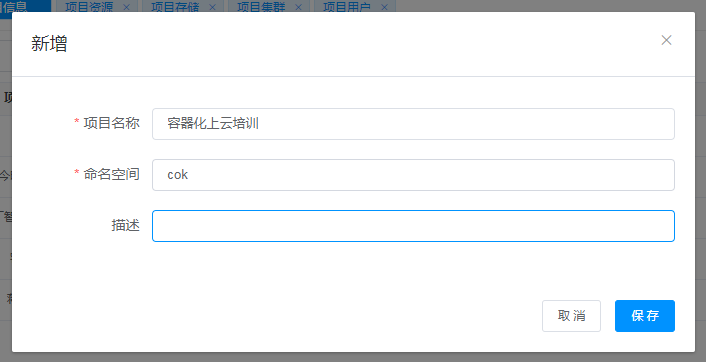
- 为项目分配k8s集群
```
端口范围： 18000 - 18999
```
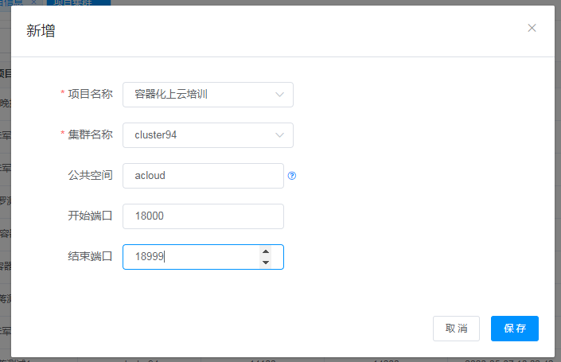
- 为项目分配用户权限
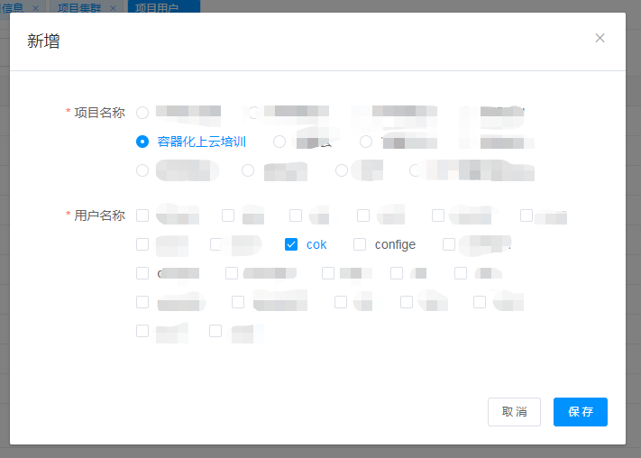
- 为项目分配两个存储：mysql、mysql-comp


## 2. 部署
### 2.1 部署mysql
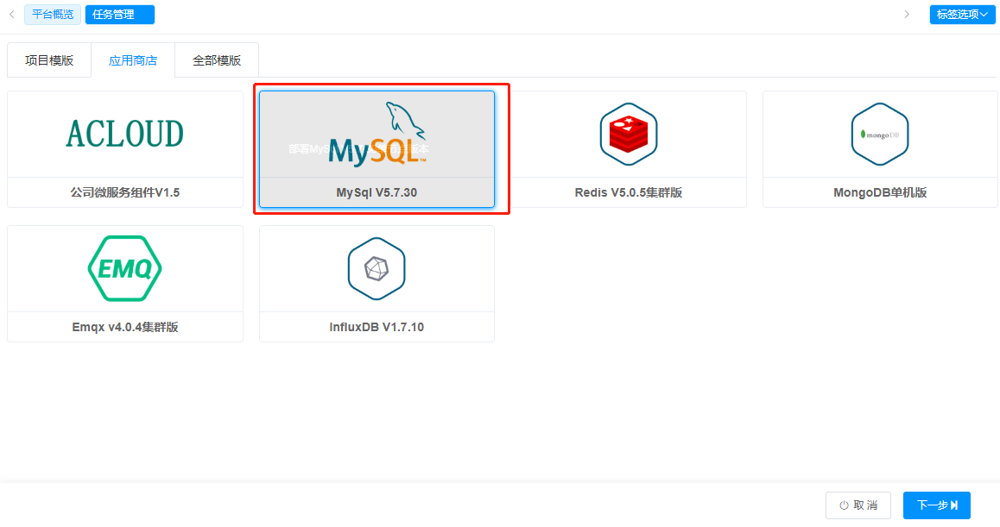
- 配置mysql参数，节点端口：`18306`
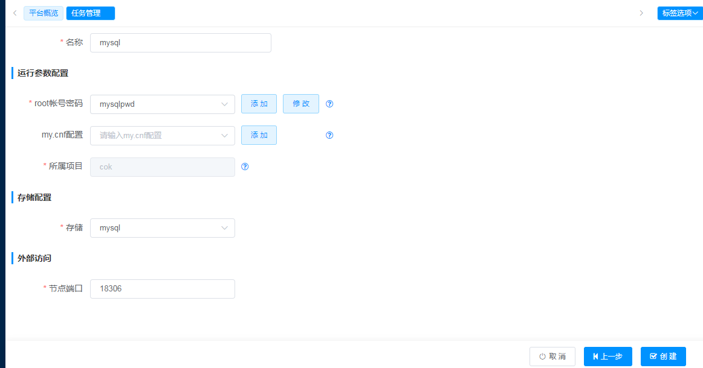

### 2.2 部署eureka
- 先设置svn下载的账号密码
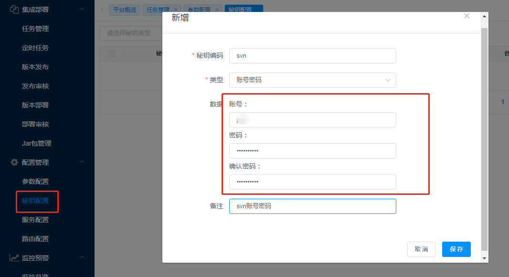

- 创建`Maven打包并构建镜像部署K8S`模板
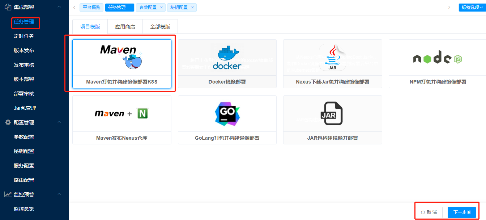

- 设置erueka模板参数
```
svn： https://192.168.0.29:8443/svn/200103/trunk/05.Code/cok/cok-source-java
dockerfile： cok-source-java-eureka/Dockerfile
监控检查端口： 18761
目标端口： 18761
集群端口： 18761
节点端口： 18761
```
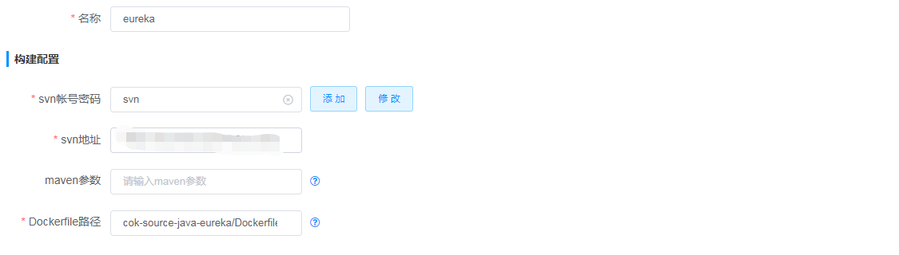
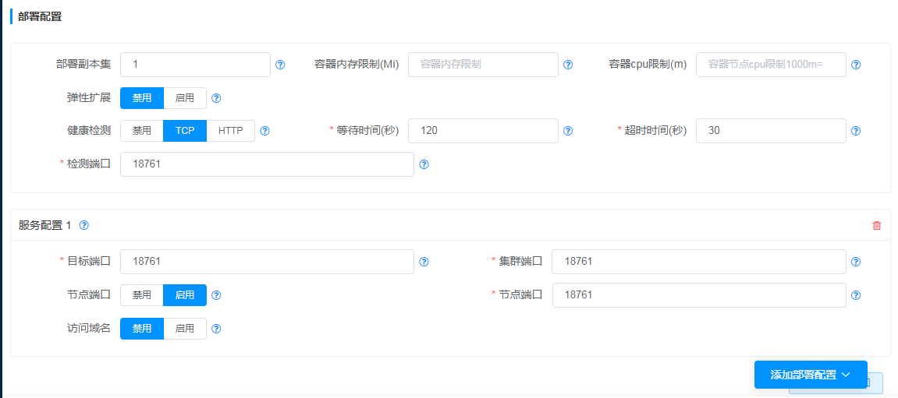

### 2.3 部署zuul
- 设置zuul模板参数
```
svn： https://192.168.0.29:8443/svn/200103/trunk/05.Code/cok/cok-source-java
dockerfile： cok-source-java-zuul/Dockerfile
监控检查端口： 18762
环境变量： EUREKA_URI  http://eureka:18761/eureka
目标端口： 18762
集群端口： 18762
节点端口： 18762
```


### 2.4 部署service1
- 增加application.yml参数配置

`service-application.yml`:
```yaml
    server:
      port: 18763
    spring:
      datasource:
        max-idle: 8
        min-idle: 8
        max-active: 20
        driverClassName: com.mysql.cj.jdbc.Driver
        initial-size: 10
        type: com.alibaba.druid.pool.DruidDataSource
        url: jdbc:mysql://mysql:3306/mysql?characterEncoding=utf8&useSSL=false&allowMultiQueries=true
        username: root
        password: 123456
      jpa:
        show-sql: true
        database: mysql
        hibernate:
          ddl-auto: create
        database-platform: org.hibernate.dialect.MySQL5Dialect
```
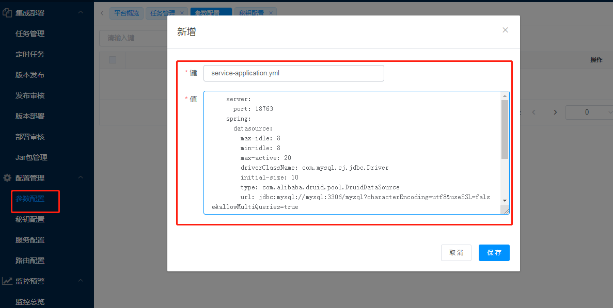
- 配置service1
```
svn： https://192.168.0.29:8443/svn/200103/trunk/05.Code/cok/cok-source-java
dockerfile： cok-source-java-service1/Dockerfile
监控检查端口： 18763
环境变量： EUREKA_URI  http://eureka:18761/eureka
文件挂载： /opt/application.yml  service-application.yml
```
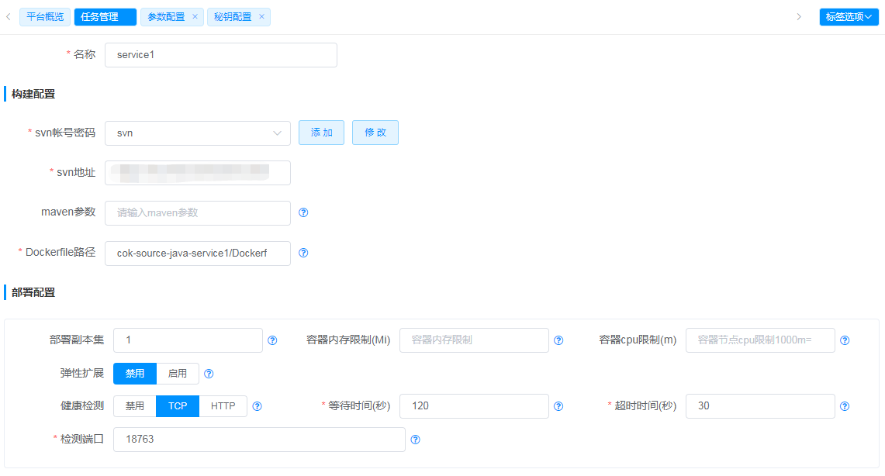


### 2.5 部署vue-ui
- 创建`NPM打包并构建镜像部署`打包模板

- 设置模板参数
```
svn： https://192.168.0.29:8443/svn/200103/trunk/05.Code/cok/cok-source-vue
dockerfile： Dockerfile
目标端口： 80
集群端口： 80
节点端口： 18765
```


## 3.测试访问

[http://192.168.3.124:18765/cok-ui/index.html](http://192.168.3.124:18765/cok-ui/index.html)
