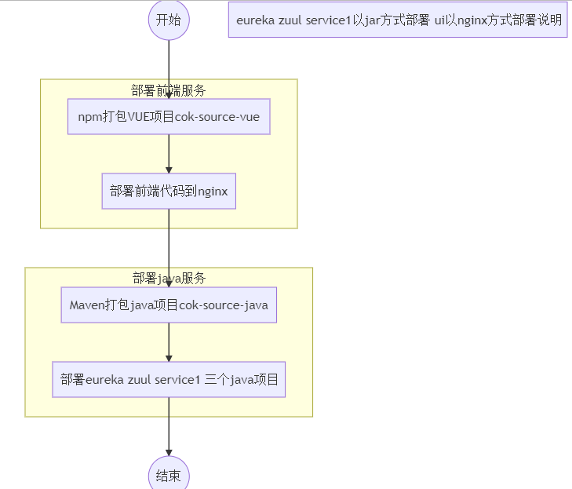
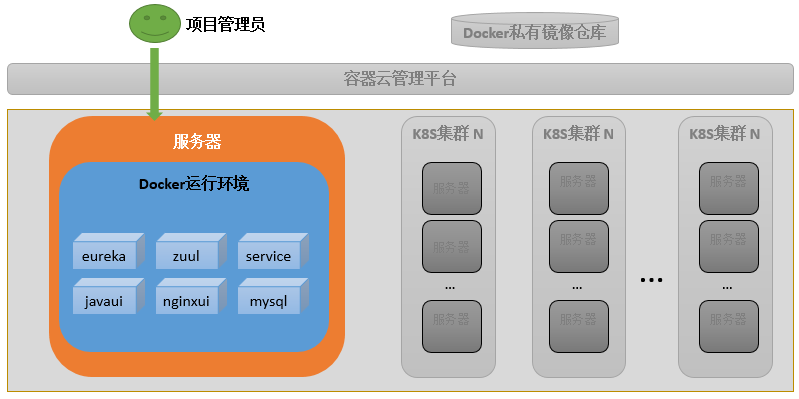
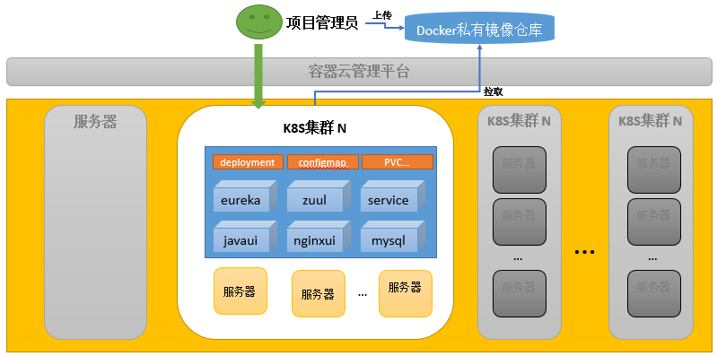
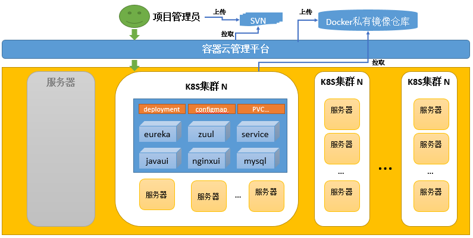

# 项目实战

## 1. 项目介绍

项目Git地址：[https://gitee.com/olivee/cok.git](https://gitee.com/olivee/cok.git)

| 文件         | 说明 |
| :-------------------| :---- |
| cok |  |
| ├── build-in-java .sh | 打包成docker镜像的命令（全部以jar方式部署） |
| ├── build-in-nginx .sh | 打包成docker镜像的命令（ui以nginx方式部署）  |
| ├── cok-source-java |  springcloud服务端代码示例  |
| │   ├── cok-source-java-eureka | eureka项目代码  |
| │   ├── cok-source-java-service1 | 微服务1项目代码  |
| │   ├── cok-source-java-ui |  ui项目 |
| │   ├── cok-source-java-zuul | zuul项目代码  |
| │   └── pom.xml |   |
| ├── cok-source-vue | VUE项目代码  |

## 2. 两种部署方式介绍
### 2.1 全部以jar方式部署流程说明

### 2.2 eureka、zuul、service1以jar方式部署，ui以nginx方式部署说明

## 3. 几种部署环境介绍

### 3.1 部署在docker中

部署步骤：
1. 项目管理员将代码打包成docker镜像
2. 直接在服务器中通过docker镜像启动eureka、zuul、service、javaui、mysql等容器服务

### 3.2 部署在k8s中

部署步骤：
1. 项目管理员将代码打包成docker镜像
2. 将打包好的镜像上传到docker私有镜像仓库
3. 在k8s中通过Deployment、ConfigMap等资源部署eureka、zuul、service、javaui、mysql等服务

### 3.3 部署在容器云平台中

部署步骤：
1. 项目管理员将代码上传SVN
2. 在容器云平台中通过集成部署任务部署eureka、zuul、service、javaui、mysql等服务（容器云平台从svn拉取代码构建镜像并部署）

### 3.4 手动部署在Linux服务器与部署在k8s中的差异

#### 3.4.1 部署方式差异
##### 直接部署在Linux服务器
- 每个组件需要手动的配置部署到具体的某一个服务器

##### 部署在k8s中

## 子章节
[3.1.部署在docker中](3.1.project-to-docker.md)

[3.2.部署在k8s中](3.2.project-to-k8s.md)

[3.3.通过容器云平台部署在k8s中](3.3.project-to-ccs.md)
