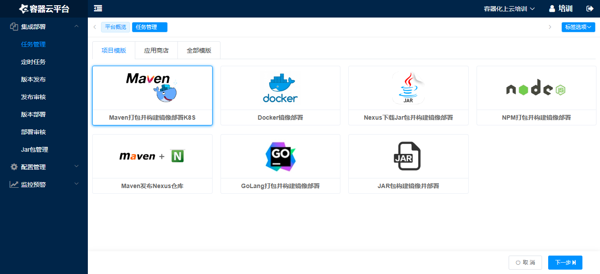
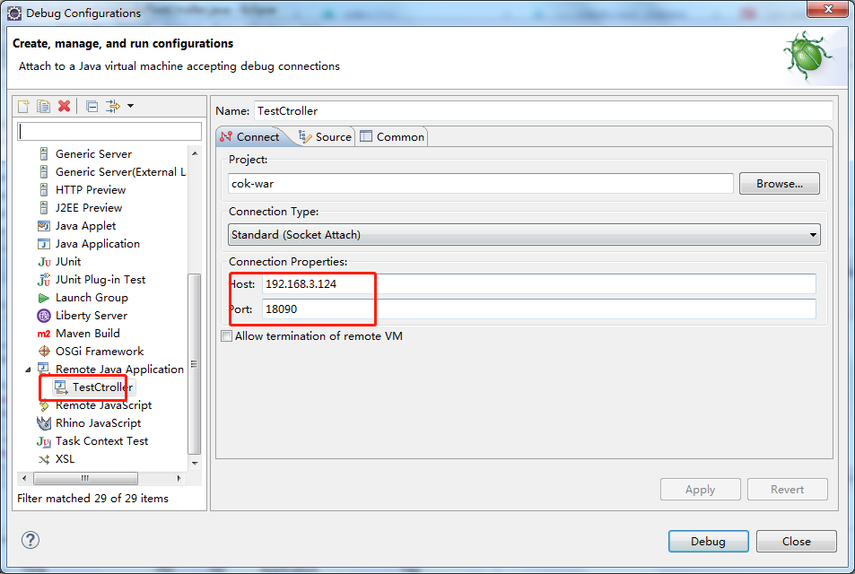

# SVN下载MAVEN项目代码并打包部署

## 1. 创建Maven打包并构建镜像部署K8S任务

### 配置任务参数
```
svn： https://192.168.0.29:8443/svn/200103/trunk/05.Code/cok/cok-war
dockerfile： Dockerfile
监控检查端口： 8080
文件挂载： /usr/local/tomcat/webapps/ROOT/WEB-INF/classes/prop/jdbc.properties maven-war-jdbc.properties
JAVA_OPTS: -Xmx512M -Xms512M -XX:MetaspaceSize=64m -XX:MaxMetaspaceSize=128m -agentlib:jdwp=transport=dt_socket,address=9080,server=y,suspend=n
服务1： 8080 8080 18080 test.maven.war.com
服务2： 9080 9080 18090
```


- 其中`maven-war-jdbc.properties`的内容：
```properties
#mysql
hibernate.dialect=org.hibernate.dialect.MySQLDialect
hibernate.connection.url=jdbc:mysql://mysql:3306/mysql?characterEncoding=utf8&useSSL=false&allowMultiQueries=true
hibernate.connection.driver_class=com.mysql.jdbc.Driver
hibernate.connection.username=root
hibernate.connection.password=123456
```


## 2. 访问测试：
### 节点端口访问：
[http://192.168.3.124:18080/test/index](http://192.168.3.124:18080/test/index)

## 域名访问：
先本机配个hosts
```
192.168.3.124 test.maven.war.com
```
再浏览器输入url测试：
[http://test.maven.war.com/test/index](http://test.maven.war.com/test/index)


## 3. 配置jvm参数：
如：设置 `JAVA_OPTS` 为 `-Xmx512M -Xms512M -XX:MetaspaceSize=64m -XX:MaxMetaspaceSize=128m`

### 远程调试
如果要远程调试，则把 `JAVA_OPTS` 修改为
`-Xmx512M -Xms512M -XX:MetaspaceSize=64m -XX:MaxMetaspaceSize=128m -agentlib:jdwp=transport=dt_socket,address=9080,server=y,suspend=n`
再将9080远程调试端口映射到节点端口


#### eclise启动远程调试

