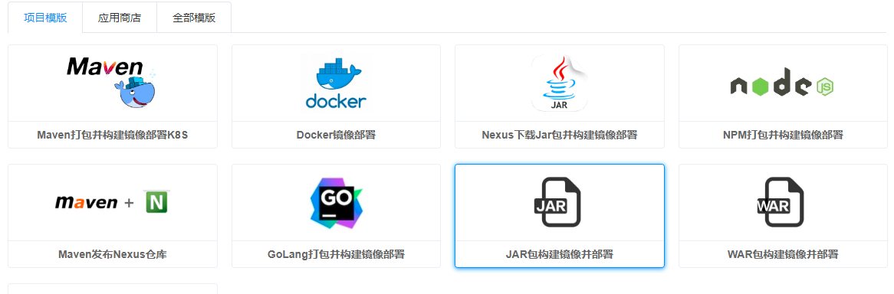
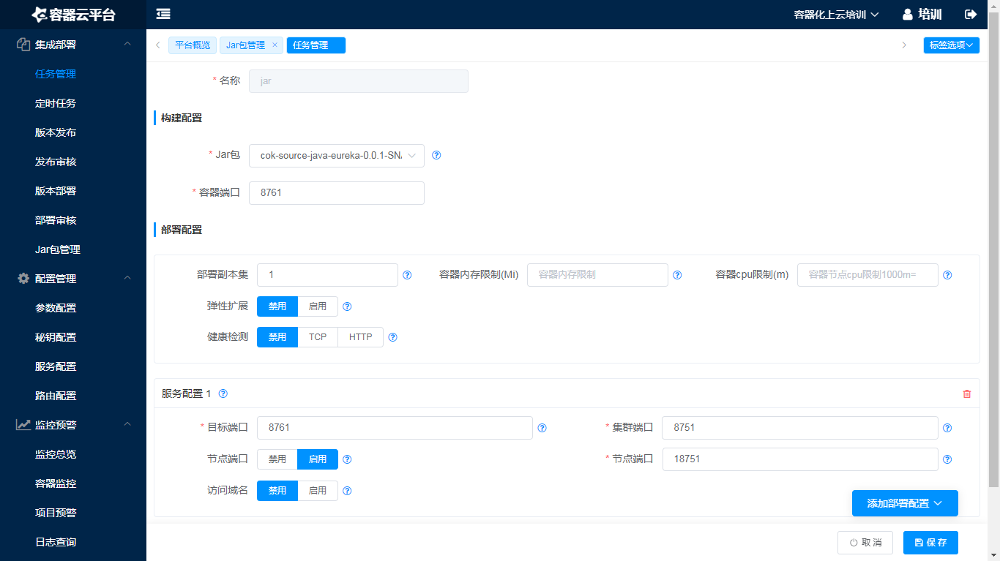
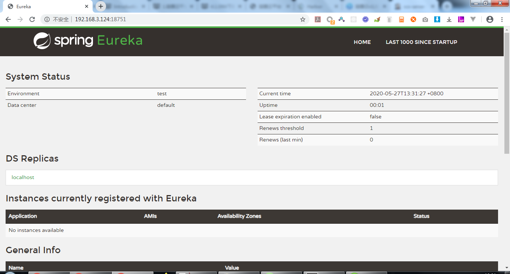

# 上传Jar包并打包部署
## 上传jar包


## 创建Jar包构建镜像并部署任务


- 配置任务参数：
 ```
jar: cok-source-java-eureka-0.0.1-SNAPSHOT.jar
容器端口： 8761
服务配置1： 8761 8751 18751
 ```



## 测试：
[http://192.168.3.124:18751/](http://192.168.3.124:18751/)

