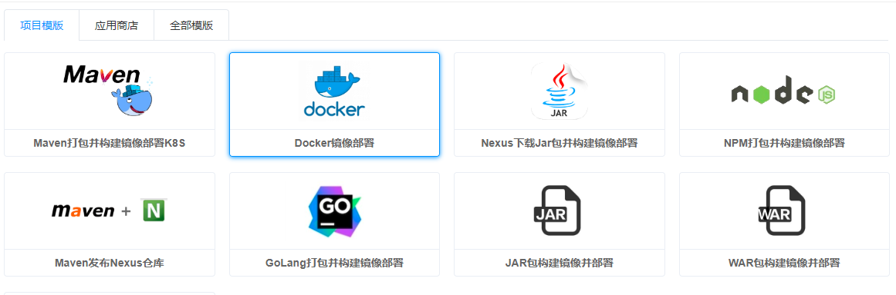
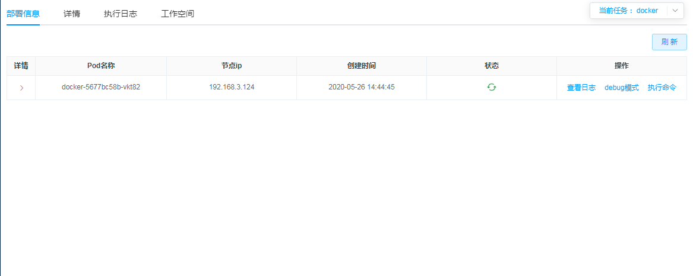
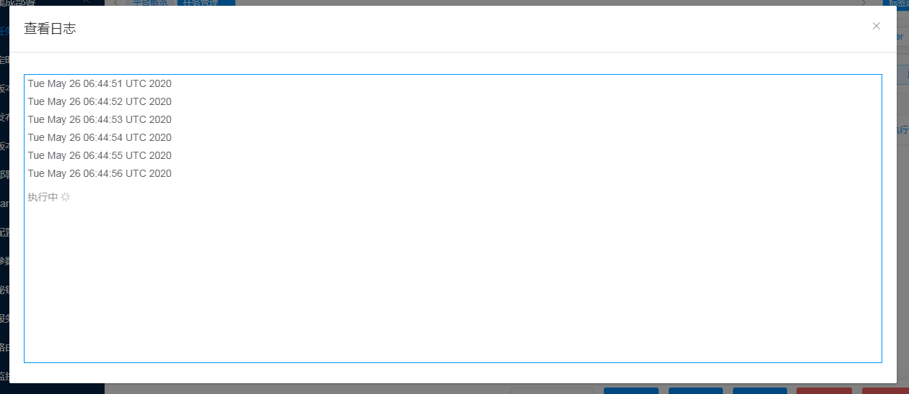

# 4.3.直接部署Docker镜像

## 1. 制作docker镜像
### 1.1 创建`loop.sh`:
```sh
while(true)
do
    date
    sleep 1
done
```

### 1.2 创建`Dockerfile`:
```dockerfile
from alpine:3.9.6
COPY loop.sh /root/
CMD ./root/loop.sh
```

### 1.3 创建打包镜像：
```sh
chmod +x *.sh
docker build -t hub.aosccs.com.cn:8888/cok/cok-docker .
```

### 1.4 推送镜像
```
docker push hub.aosccs.com.cn:8888/cok/cok-docker
```

## 2.创建部署任务

### 2.1 选择模板



### 2.2 定义模板参数
```
镜像： hub.aosccs.com.cn:8888/cok/cok-docker
```


## 查看部署结果
- 查看pod

- 查看pod的运行日志

