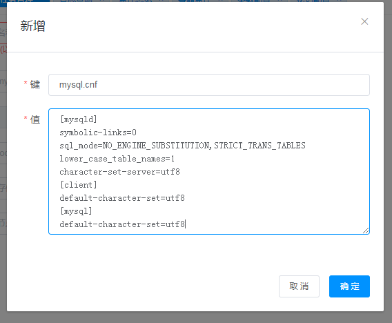
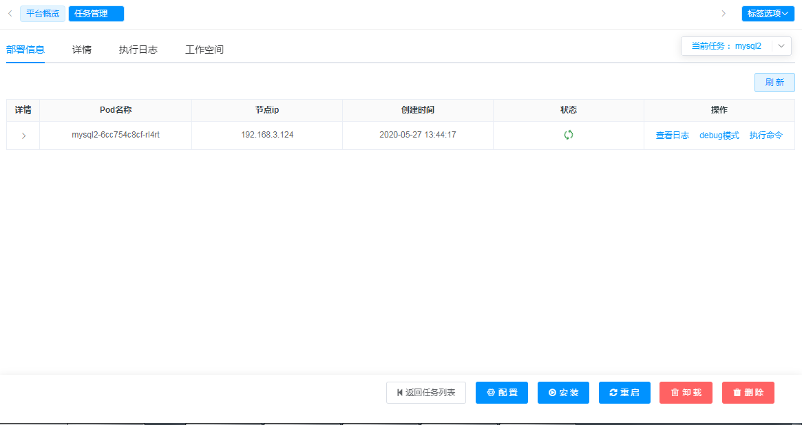

# 应用商店部署


## 1. 安装mysql公共组件
## 1.1 新增mysql参数配置
`mysql.cnf`:
```properties
[mysqld]
symbolic-links=0
sql_mode=NO_ENGINE_SUBSTITUTION,STRICT_TRANS_TABLES
lower_case_table_names=1
character-set-server=utf8
[client]
default-character-set=utf8
[mysql]
default-character-set=utf8
```


## 2. 创建部署任务

### 2.1 选择MySQL公共组件

### 2.2 设置部署参数
```
任务名称： mysql2
my.cnf配置： mysql.cnf
root帐号密码：
存储： mysql2
节点端口： 18307
```


### 2.3 执行安装任务


### 2.4 查看部署结果


## 3. 连接测试
```
主机名/IP： 192.168.3.124
用户： root
密码：
端口： 18307
```

