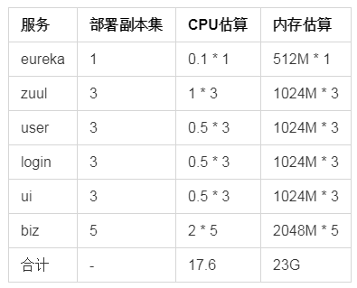

# 项目实施容器化上云要点说明

## 1. K8S中的共享存储
- 如项目中需要用到共享存储（如：文件上传），则需要申请共享存储
- 在k8s中一般不用服务器的本地存储（因为Pod可能随机的飘在多个服务器，且本地存储在多个pod不可以共享）

## 2. 资源需求
如果客服要求提供容器上云的资源需求（CPU/内存/存储）估算，可以先估算每个服务要启动几个Pod，再把所有Pod的内存/CPU估算加起来(CPU估算一般按照性能测试时候的CPU来估算)，比如下表：

 

则大致估计这个项目需要的CPU内存资源为18C23G，客户会按照这个需求给我们分配K8S资源（具体的独立的还是共享的K8S资源，要看现场情况）

## 3. 内存/CPU限制
- 如果一个项目单独用一套k8s，不建议设置服务的CPU、内存限制
- 对于Java容器，`建议设置Pod的内存限制`，`不设置CPU限制`（一是由于设置CPU限制后可能导致启动很慢，二是大多数情况下程序都是经过了性能和疲劳测试，部署多个服务的时候每个服务的CPU的波动可能比较大，不好去做CPU的限制）
- 坑：对于SpringBoot项目，如果设置了CPU限制，且设置的较小(如100m)，则可能导致服务很久起不来。（如果配置了监控检查，还可能导致启动超时容器Crash）
- 如果是Java程序，Docker镜像文件中一定要把JVM的启动参数通过环境变量的方式放出来，以支持测试/生产环境配置不同的JVM内存参数
- 坑：JDK 8一定要配置MaxMetaspaceSize，避免内存持续增长（某些JDK版本可能存在内存溢出问题，也需要特别注意）

## 4. 哪些项目适合上K8S，哪些不适合
### 不适合上K8S的场景
- 如果项目本身比较简单，比如只有一个war包+数据库，则建议直接部署在服务器（因为部署在K8S需要一定的学习成本和后期的运维成本）（除非客户强制要求所有业务上容器，且有现成的K8S集群可用）
- 如果某个模块的业务与IP地址绑定，则该模板不能用容器，因为容器的IP地址是变化的

### 适合上K8S的场景
- 项目部署的包比较多（8个以上），且发版比较频繁
- 需要用到K8S的健康检查、弹性扩展、统一日志、统一监控等技术

## 5. K8S中的会话保持
- 一般k8s中部署的服务都是无状态的
- 如果一个服务部署了多个Pod，且服务需要会话保持，可以用Ingress中的会话保持技术实现

## 6. 镜像文件的制作
- 尽量制作较小的镜像（基于alpine或busybox基础来制作镜像）
- 尽量精简Docker镜像（1.同一个文件/文件夹尽量不要在多条指令中操作；2.尽量用更少的指令;3.多条RUN指令建议合并成一行）
- 尽量不要基于centos等基础基础镜像来制作（除非有某些特殊需求）
