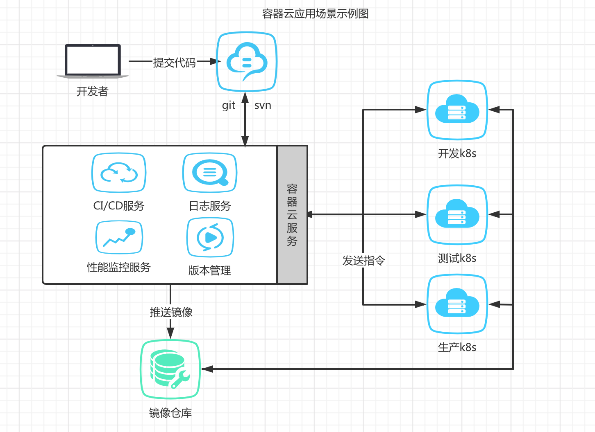
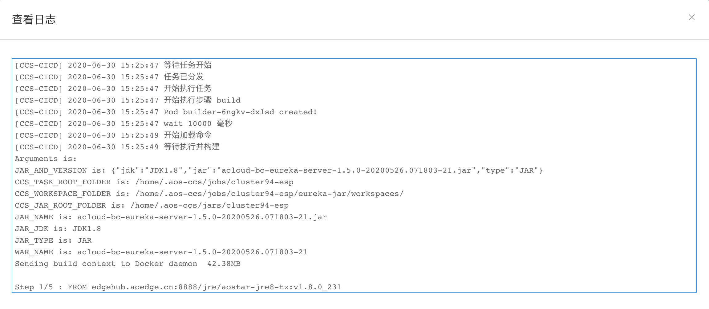
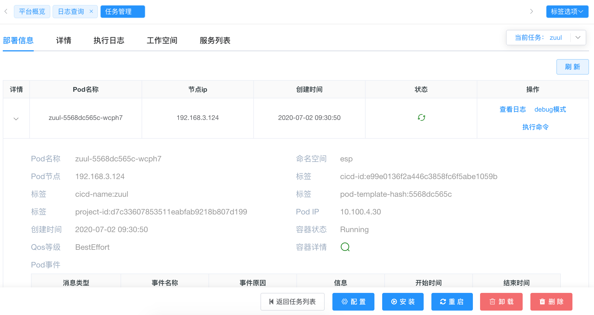
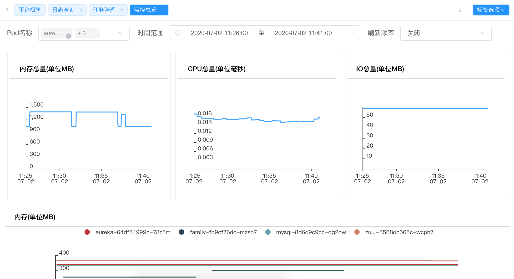

# 1.在k8s中CI/CD的实现方式
## 1.1 容器云场景图

## 1.2 CICD流程图

 - 1.创建任务，选择模版或者应用商店。
 - 2.填写项目基础信息，包括项目的svn地址，账号密码，项目运行参数等等。
 - 3.填写容器基础信息，包括项目集群需要的副本集，弹性扩展，健康检测。
 - 4.填写容器服务信息，包括项目集群端口暴露，http或者https域名的创建。
 - 5.创建，发布任务到k8s集群。
 ## 1.3 任务监控
 
 ## 1.4 容器监控

 ## 1.5 指标监控
 
 ## 1.6 项目日志监控
 
