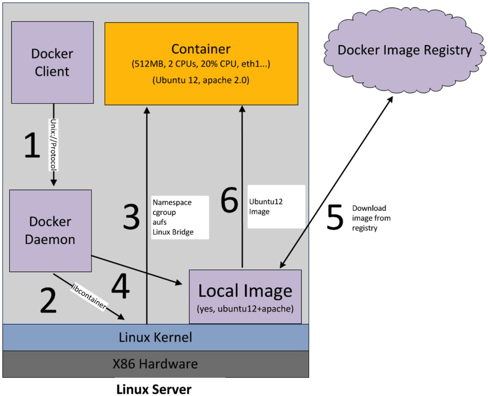
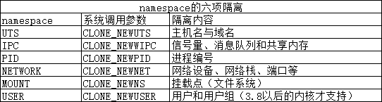

# 2.Docker底层原理
## 1. Docker容器的启动过程：
 - 容器的启动命令：
  docker run -i -t ubuntu /bin/bash

  1. docker client(即：docker终端命令行)会调用docker daemon请求启动一个容器，
  2. docker daemon会向host os(即：linux)请求创建容器
  3. linux会创建一个空的容器（可以简单理解为：一个未安装操作系统的裸机，只有虚拟出来的CPU、内存等硬件资源）
  4. docker daemon请检查本机是否存在docker镜像文件（可以简单理解为操作系统安装光盘），如果有，则加载到容器中（即：光盘插入裸机，准备安装操作系统）
  5. 将镜像文件加载到容器中（即：裸机上安装好了操作系统，不再是裸机状态）
## 2. Docker的核心技术：
  Docker容器本质上是属主机上的进程。Docker通过namespace实现了资源隔离，通过cgroups实现了资源限制，通过写时复制机制（copy-on-write）实现了高效的文件操作。
 - namespace 是 Linux 为我们提供的用于分离进程树、网络接口、挂载点以及进程间通信等资源的方法。Linux内核提供了下面6种namespace隔离的系统调用。目的就是实现轻量级虚拟化（容器）服务。在同一个namespace下的进程可以感知彼此，而对外界的进程一无所知。以达到独立和隔离的目的。
 
 参考：http://dockone.io/article/2941
 - cgroups资源限制，四大功能
  资源限制：可以对任务使用的资源总额进行限制
　优先级分配：通过分配的cpu时间片数量以及磁盘IO带宽大小，实际上相当于控制了任务运行优先级
　资源统计：可以统计系统的资源使用量，如cpu时长，内存用量等
　任务控制：cgroup可以对任务执行挂起、恢复等操作
## 3. 容器化思维：
###### 我如何进行容器调试，该怎么办？
###### sshd要怎么配置？
###### 容器如何做备份？
  - SSH服务器的替代方案
  首先Docker不是一个轻量级虚拟机技术，他实际上是一个进程，所以不需要考虑ssh服务器，也就不需要配置。在容器里，提供 docker exec命令， 可以进入已经运行的容器，在里面执行命令。
  - 如果说要长期使用的配置文件，就做到镜像中，如果是经常修改的配置文件，就需要用到docker数据卷共享这个配置文件。
