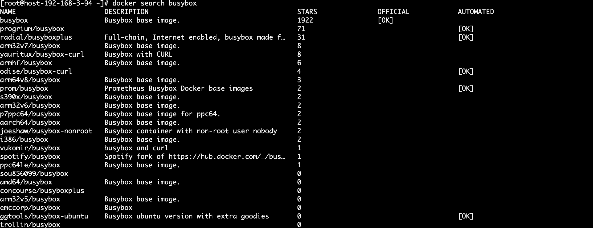
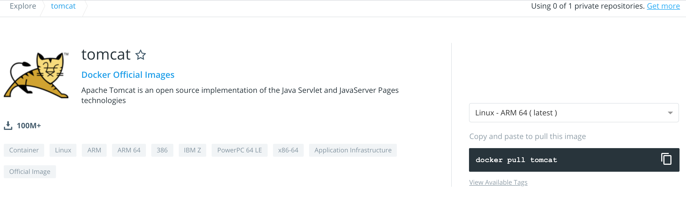
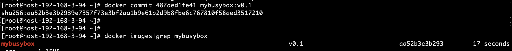

# 3.1.1 场景一、命令行构建镜像


### 1. 查找合适的基础镜像
    -   docker images 查找本地镜像
```shell
   docker images
```
  
    - docker search 查找dockerhub镜像。如果是pull太慢，可以设置阿里的容器镜像服务。
```shell
   docker search mysql
```
  
    - 通过 dockerhub 查找镜像。
```shell
   docker pull openjdk:8u252-jre

   docker pull tomcat:8.5.56-jdk8-adoptopenjdk-hotspot
```
  
  
  
### 2. 运行并进入到容器
  - 后台方式运行一个容器。
  - docker run 命令：
```shell
  -a stdin: 指定标准输入输出内容类型，可选 STDIN/STDOUT/STDERR 三项；

  -d: 后台运行容器，并返回容器ID；

  -i: 以交互模式运行容器，通常与 -t 同时使用；

  -P: 随机端口映射，容器内部端口随机映射到主机的端口

  -p: 指定端口映射，格式为：主机(宿主)端口:容器端口

  -t: 为容器重新分配一个伪输入终端，通常与 -i 同时使用；

  --name="nginx-lb": 为容器指定一个名称；

  --dns 8.8.8.8: 指定容器使用的DNS服务器，默认和宿主一致；

  --dns-search example.com: 指定容器DNS搜索域名，默认和宿主一致；

  -h "mars": 指定容器的hostname；

  -e username="ritchie": 设置环境变量；

  --env-file=[]: 从指定文件读入环境变量；

  --cpuset="0-2" or --cpuset="0,1,2": 绑定容器到指定CPU运行；

  -m :设置容器使用内存最大值；

  --net="bridge": 指定容器的网络连接类型，支持 bridge/host/none/container: 四种类型；

  --link=[]: 添加链接到另一个容器；

  --expose=[]: 开放一个端口或一组端口；

  --volume , -v: 绑定一个卷
```
```shell
  docker run -itd busybox:1.29.3
  docker exec -it 482aed1fe41 sh
```

 
 -  进入运行中的容器并修改配置文件。
 
### 3. 提交一个新的容器
  - 对刚才修改后的容器保存一个新镜像。
  ```shell
    docker commit 482aed1fe41 mybusybox:v0.1
  ```


### 4. 验证新的容器

