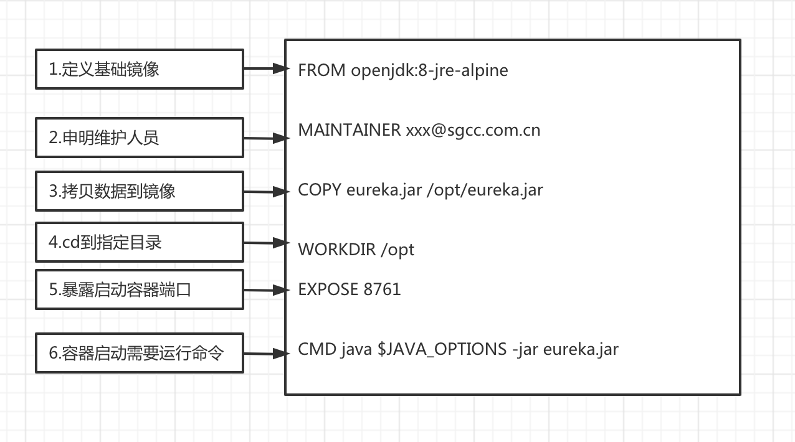

# 3.1.2 场景二、Dockerfile构建
### 1.dockerfile语法：

 参考：https://db2go.net/k8s/docker/3-dockerfile%E4%BB%8B%E7%BB%8D.html
### 2.编写镜像文件Dockerfile步骤图：

### 3.构建镜像文件Dockerfile：
```shell
构建命令： docker build -t eureka:jre8-v1.0  .

Sending build context to Docker daemon  42.91MB
Step 1/6 : FROM openjdk:8-jre-alpine
 ---> f7a292bbb70c
Step 2/6 : MAINTAINER xxx@sgcc.com.cn
 ---> Using cache
 ---> 8c3ba67a2209
Step 3/6 : COPY eureka.jar /opt/eureka.jar
 ---> Using cache
 ---> 316ca7606ca5
Step 4/6 : WORKDIR /opt
 ---> Using cache
 ---> b8940ce2741e
Step 5/6 : EXPOSE 8761
 ---> Using cache
 ---> b67b2687a83f
Step 6/6 : CMD java $JAVA_OPTIONS -jar eureka.jar
 ---> Using cache
 ---> ea902f82499a
Successfully built ea902f82499a
Successfully tagged eureka:jre8-v1.0
```
### 4.查找并运行镜像：
```shell
  docker images|grep eureka
  docker run -d -e JAVA_OPTIONS='-Xmx512M -Xms512M' hub.aosccs.com.cn:8888/test1/docker-acloud-bc-eureka-demo:1.5.0-SNAPSHOT 
```

 - docker ps|grep eureka 查询运行到容器

