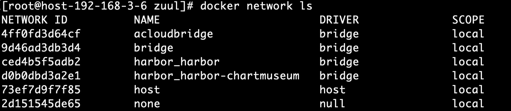
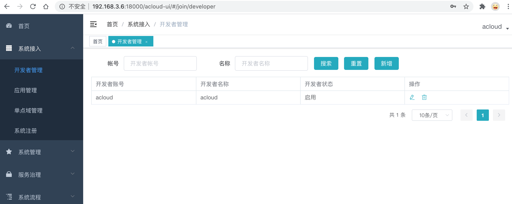

# 3.2.微服务应用构建
### 准备工作，1.准备微服务需要的数据库，redis。2.微服务容器网络创建：
```shell
docker network create -d bridge acloudbridge
```

### 1.准备微服务eureka jar包，编写镜像文件Dockerfile：
```shell
FROM openjdk:8-jre-alpine

MAINTAINER xxx@sgcc.com.cn

RUN ln -sf /usr/share/zoneinfo/Asia/Shanghai /etc/localtime && echo 'Asia/Shanghai' >/etc/timezone

COPY acloud-bc-eureka-server-1.5.0-20191104.021740-73.jar /u01/app.jar

WORKDIR /u01

EXPOSE 18003

CMD java -Xmx512M -Xms512M -XX:MetaspaceSize=64m -XX:MaxMetaspaceSize=128m -jar app.jar
```
### 2.构建镜像文件Dockerfile：
```shell
[root@host-192-168-3-6 eureka]# docker build -t hub.aosccs.com.cn:8888/test1/docker-acloud-bc-eureka-server:1.5.0-SNAPSHOT .
Sending build context to Docker daemon  66.82MB
Step 1/7 : FROM openjdk:8-jre-alpine
 ---> f7a292bbb70c
Step 2/7 : RUN ln -sf /usr/share/zoneinfo/Asia/Shanghai /etc/localtime && echo 'Asia/Shanghai' >/etc/timezone
 ---> Using cache
 ---> 692554e348a5
Step 3/7 : MAINTAINER xxx@sgcc.com.cn
 ---> Using cache
 ---> 7b6f340614d6
Step 4/7 : COPY acloud-bc-eureka-server-1.5.0-20191104.021740-73.jar /u01/app.jar
 ---> Using cache
 ---> 17acd0f679c0
Step 5/7 : WORKDIR /u01
 ---> Using cache
 ---> f9983504e266
Step 6/7 : EXPOSE 18003
 ---> Using cache
 ---> 7018737f83e5
Step 7/7 : CMD java -Xmx512M -Xms512M -XX:MetaspaceSize=64m -XX:MaxMetaspaceSize=128m -jar app.jar
 ---> Running in 3499e7c24271
Removing intermediate container 3499e7c24271
 ---> ddf59ada10d6
Successfully built ddf59ada10d6
Successfully tagged hub.aosccs.com.cn:8888/test1/docker-acloud-bc-eureka-server:1.5.0-SNAPSHOT
```
### 3.启动eureka容器：
```shell
docker run -itd --network acloudbridge  --name acloud-eureka -p 18003:18003 -v /root/luojunjie/docker/acloud/eureka/logs:/u01/target/logs  -v /root/luojunjie/docker/acloud/eureka/application.yml:/u01/application.yml -v /root/luojunjie/docker/acloud/eureka/bootstrap.yml:/u01/bootstrap.yml  hub.aosccs.com.cn:8888/test1/docker-acloud-bc-eureka-server:1.5.0-SNAPSHOT  
```


### 4.准备微服务zuul jar包，编写镜像文件Dockerfile：
```shell
FROM openjdk:8-jre-alpine

MAINTAINER xxx@sgcc.com.cn

RUN ln -sf /usr/share/zoneinfo/Asia/Shanghai /etc/localtime && echo 'Asia/Shanghai' >/etc/timezone


COPY acloud-bc-zuul-server-1.5.0-20191205.105939-106.jar /u01/app.jar

WORKDIR /u01

EXPOSE 18000

CMD java -Xmx512M -Xms512M -XX:MetaspaceSize=64m -XX:MaxMetaspaceSize=128m -jar app.jar
```
### 5.构建镜像文件Dockerfile：
```shell
docker build -t hub.aosccs.com.cn:8888/test1/docker-acloud-bc-zuul-server:1.5.0-SNAPSHOT .
```
### 6.启动zuul容器：
```shell
docker run -itd --network acloudbridge -p 18000:18000 -v /root/luojunjie/docker/acloud/zuul/logs:/u01/target/logs  -v /root/luojunjie/docker/acloud/zuul/application.yml:/u01/application.yml -v /root/luojunjie/docker/acloud/zuul/bootstrap.yml:/u01/bootstrap.yml  hub.aosccs.com.cn:8888/test1/docker-acloud-bc-zuul-server:1.5.0-SNAPSHOT
```
### 7.准备微服务family jar包，编写镜像文件Dockerfile：
```shell
FROM openjdk:8-jre-alpine

MAINTAINER xxx@sgcc.com.cn

RUN ln -sf /usr/share/zoneinfo/Asia/Shanghai /etc/localtime && echo 'Asia/Shanghai' >/etc/timezone


COPY acloud-family-server-jdbc-1.5.0-20191205.110300-143.jar /u01/app.jar

WORKDIR /u01

EXPOSE 18001

CMD java -Xmx512M -Xms512M -XX:MetaspaceSize=64m -XX:MaxMetaspaceSize=128m -jar app.jar
```
### 8.构建镜像文件Dockerfile：
```shell
docker build -t hub.aosccs.com.cn:8888/test1/docker-acloud-bc-family-server:1.5.0-SNAPSHOT .
```
### 9.启动family容器：
```shell
docker run -itd --network acloudbridge -p 18001:18001 -v /root/luojunjie/docker/acloud/family/logs:/u01/target/logs  -v /root/luojunjie/docker/acloud/family/application.yml:/u01/application.yml -v /root/luojunjie/docker/acloud/family/bootstrap.yml:/u01/bootstrap.yml  hub.aosccs.com.cn:8888/test1/docker-acloud-bc-family-server:1.5.0-SNAPSHOT  
```
### 10.登录微服务：
docker 查询结果



