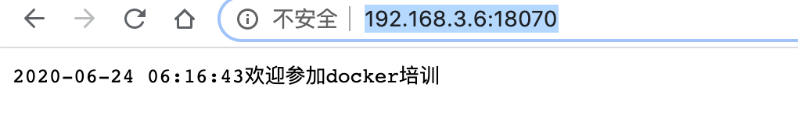

# 3.5.go应用构建
### 准备工作，1.程序源码
```shell
package main


import (
    "fmt"
    "log"
    "net/http"
    "time"
)

func sayHello(w http.ResponseWriter, r *http.Request) {
      new :=time.Now()
     fmt.Fprintf(w,new.Format("2006-01-02 15:04:05"))    
     fmt.Fprintf(w, "欢迎参加docker培训")
}
func main() {
    http.HandleFunc("/", sayHello)//注册URI路径
    log.Println("【docker项目】服务启动成功 监听端口 80")
    er := http.ListenAndServe("0.0.0.0:80", nil)
    if er != nil {
        log.Fatal("ListenAndServe: ", er)
    }

}

```
### 1.go 加入依赖库编译：
```shell
CGO_ENABLED=0 GOOS=linux go build -a -installsuffix cgo -o main main.go
```
### 2.编写镜像文件Dockerfile：
```shell
FROM scratch
ADD main /
ENTRYPOINT ["/main"]
```
### 3.构建镜像文件Dockerfile：
```shell
docker build -t hub.aosccs.com.cn:8888/test1/go-web-demo:v1.0 .
```
### 4.启动容器：
```shell
docker run -itd --name go-web-demo -p 18070:80  hub.aosccs.com.cn:8888/test1/go-web-demo:v1.0
```
### 5.访问：
http://192.168.3.6:18070/

