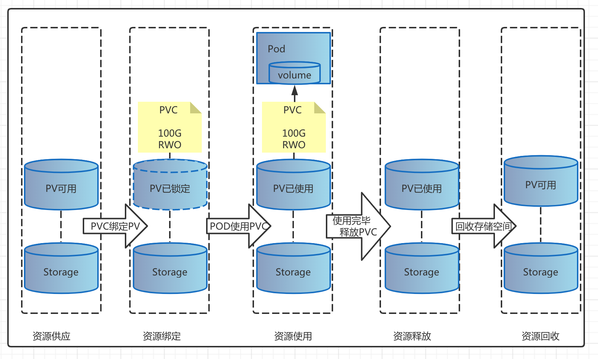

# 3.在k8s持久化存储
- pv和pvc和sc的生命周期

## 3.1. PV
- 持久化卷， 支持本地存储和网络存储， 例如hostpath，ceph rbd， nfs等，只支持两个属性， capacity和accessModes。其中capacity只支持size的定义，不支持iops等参数的设定，accessModes有三种，ReadWriteOnce（被单个node读写）， ReadOnlyMany（被多个nodes读）， ReadWriteMany（被多个nodes读写）
```shell
apiVersion: v1
kind: PersistentVolume
metadata:
  labels:
    app: workspaces-pv
  name: workspaces-pv
spec:
  accessModes:
  - ReadWriteMany
  capacity:
    storage: 5Gi
  claimRef:
    apiVersion: v1
    kind: PersistentVolumeClaim
    name: workspaces-pvc
    namespace: portal-nx
  nfs:
    path: /home/nfs/workspaces-pvc
    server: 192.168.3.149
  persistentVolumeReclaimPolicy: Retain
  volumeMode: Filesystem
```

## 3.2. PVC
- 对pv或者storageclass资源的请求， pvc 对 pv 类比于pod 对不同的cpu， mem的请求。
```shell
apiVersion: v1
kind: PersistentVolumeClaim
metadata:
  annotations:
    volume.beta.kubernetes.io/storage-provisioner: fuseim.pri/ifs
  name: mysql-data
  namespace: esp
spec:
  accessModes:
  - ReadWriteMany
  resources:
    requests:
      storage: 20Gi
  storageClassName: managed-nfs-storage
```
## 3.3. storageclass
- 另外一种提供存储资源的方式， 提供更多的层级选型， 如iops等参数。 但是具体的参数与提供方是绑定的。 如aws和gce它们提供的storageclass的参数可选项是有不同的。
```shell
apiVersion: storage.k8s.io/v1
kind: StorageClass
metadata:
  name: managed-nfs-storage
parameters:
  archiveOnDelete: "false"
provisioner: fuseim.pri/ifs
reclaimPolicy: Delete
volumeBindingMode: Immediate
```
