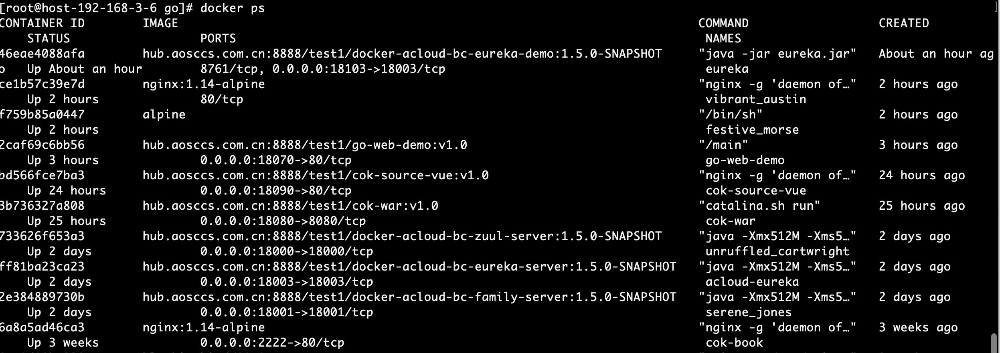
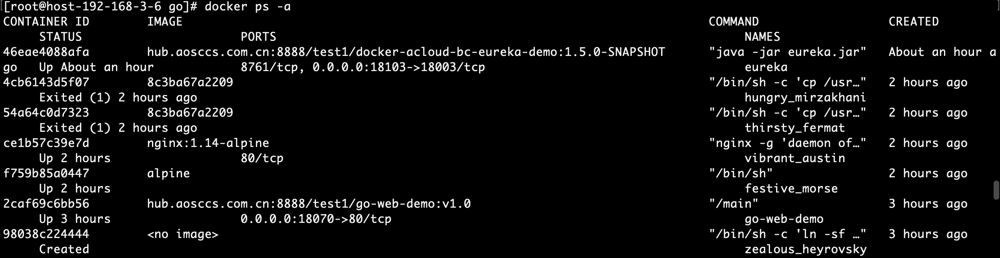

# 4.1.容器监控

### 1.docker ps 命令
```shell
docker ps
```

```shell
docker ps -a
```


### 2.docker stats 命令

```shell
docker stats 2caf69c6bb56
```


### 3.docker inspect 命令

```shell
docker inspect 2caf69c6bb56


[
    {
        "Id": "2caf69c6bb56e1ae0081a4d923d4577cb393458de1f4e02e3d608dfdb4652b44",
        "Created": "2020-06-24T06:30:10.97345785Z",
        "Path": "/main",
        "Args": [],
        "State": {
            "Status": "running",
            "Running": true,
            "Paused": false,
            "Restarting": false,
            "OOMKilled": false,
            "Dead": false,
            "Pid": 18112,
            "ExitCode": 0,
            "Error": "",
            "StartedAt": "2020-06-24T06:30:11.382188297Z",
            "FinishedAt": "0001-01-01T00:00:00Z"
        },
        "Image": "sha256:a7ec304e4215d981b7a007475c3bd95badd0434f1018ae55f7de482a2a366f05",
        "ResolvConfPath": "/dockerdata/docker/containers/2caf69c6bb56e1ae0081a4d923d4577cb393458de1f4e02e3d608dfdb4652b44/resolv.conf",
        "HostnamePath": "/dockerdata/docker/containers/2caf69c6bb56e1ae0081a4d923d4577cb393458de1f4e02e3d608dfdb4652b44/hostname",
        "HostsPath": "/dockerdata/docker/containers/2caf69c6bb56e1ae0081a4d923d4577cb393458de1f4e02e3d608dfdb4652b44/hosts",
        "LogPath": "/dockerdata/docker/containers/2caf69c6bb56e1ae0081a4d923d4577cb393458de1f4e02e3d608dfdb4652b44/2caf69c6bb56e1ae0081a4d923d4577cb393458de1f4e02e3d608dfdb4652b44-json.log",
        "Name": "/go-web-demo",
        "RestartCount": 0,
        "Driver": "overlay2",
        "Platform": "linux",
        "MountLabel": "",
        "ProcessLabel": "",
        "AppArmorProfile": "",
        "ExecIDs": null,
        "HostConfig": {
            "Binds": [
                "/etc/localtime:/etc/localtime"
            ],
            "ContainerIDFile": "",
            "LogConfig": {
                "Type": "json-file",
                "Config": {}
            },
            "NetworkMode": "default",
            "PortBindings": {
                "80/tcp": [
                    {
                        "HostIp": "",
                        "HostPort": "18070"
                    }
                ]
            },
            "RestartPolicy": {
                "Name": "no",
                "MaximumRetryCount": 0
            },
            "AutoRemove": false,
            "VolumeDriver": "",
            "VolumesFrom": null,
            "CapAdd": null,
            "CapDrop": null,
            "Dns": [],
            "DnsOptions": [],
            "DnsSearch": [],
            "ExtraHosts": null,
            "GroupAdd": null,
            "IpcMode": "shareable",
            "Cgroup": "",
            "Links": null,
            "OomScoreAdj": 0,
            "PidMode": "",
            "Privileged": false,
            "PublishAllPorts": false,
            "ReadonlyRootfs": false,
            "SecurityOpt": null,
            "UTSMode": "",
            "UsernsMode": "",
            "ShmSize": 67108864,
            "Runtime": "runc",
            "ConsoleSize": [
                0,
                0
            ],
            "Isolation": "",
            "CpuShares": 0,
            "Memory": 0,
            "NanoCpus": 0,
            "CgroupParent": "",
            "BlkioWeight": 0,
            "BlkioWeightDevice": [],
            "BlkioDeviceReadBps": null,
            "BlkioDeviceWriteBps": null,
            "BlkioDeviceReadIOps": null,
            "BlkioDeviceWriteIOps": null,
            "CpuPeriod": 0,
            "CpuQuota": 0,
            "CpuRealtimePeriod": 0,
            "CpuRealtimeRuntime": 0,
            "CpusetCpus": "",
            "CpusetMems": "",
            "Devices": [],
            "DeviceCgroupRules": null,
            "DiskQuota": 0,
            "KernelMemory": 0,
            "MemoryReservation": 0,
            "MemorySwap": 0,
            "MemorySwappiness": null,
            "OomKillDisable": false,
            "PidsLimit": 0,
            "Ulimits": null,
            "CpuCount": 0,
            "CpuPercent": 0,
            "IOMaximumIOps": 0,
            "IOMaximumBandwidth": 0,
            "MaskedPaths": [
                "/proc/asound",
                "/proc/acpi",
                "/proc/kcore",
                "/proc/keys",
                "/proc/latency_stats",
                "/proc/timer_list",
                "/proc/timer_stats",
                "/proc/sched_debug",
                "/proc/scsi",
                "/sys/firmware"
            ],
            "ReadonlyPaths": [
                "/proc/bus",
                "/proc/fs",
                "/proc/irq",
                "/proc/sys",
                "/proc/sysrq-trigger"
            ]
        },
        "GraphDriver": {
            "Data": {
                "LowerDir": "/dockerdata/docker/overlay2/895f0164e245f5597256458910180049d892df1e33bc5c66685857891f6d3fd3-init/diff:/dockerdata/docker/overlay2/508a92d1a4cfee6eec3248e7cb97ce0b5387ef143f2530ad7bbcd06ae7bff21d/diff",
                "MergedDir": "/dockerdata/docker/overlay2/895f0164e245f5597256458910180049d892df1e33bc5c66685857891f6d3fd3/merged",
                "UpperDir": "/dockerdata/docker/overlay2/895f0164e245f5597256458910180049d892df1e33bc5c66685857891f6d3fd3/diff",
                "WorkDir": "/dockerdata/docker/overlay2/895f0164e245f5597256458910180049d892df1e33bc5c66685857891f6d3fd3/work"
            },
            "Name": "overlay2"
        },
        "Mounts": [
            {
                "Type": "bind",
                "Source": "/etc/localtime",
                "Destination": "/etc/localtime",
                "Mode": "",
                "RW": true,
                "Propagation": "rprivate"
            }
        ],
        "Config": {
            "Hostname": "2caf69c6bb56",
            "Domainname": "",
            "User": "",
            "AttachStdin": false,
            "AttachStdout": false,
            "AttachStderr": false,
            "ExposedPorts": {
                "80/tcp": {}
            },
            "Tty": true,
            "OpenStdin": true,
            "StdinOnce": false,
            "Env": [
                "PATH=/usr/local/sbin:/usr/local/bin:/usr/sbin:/usr/bin:/sbin:/bin"
            ],
            "Cmd": null,
            "Image": "hub.aosccs.com.cn:8888/test1/go-web-demo:v1.0",
            "Volumes": null,
            "WorkingDir": "",
            "Entrypoint": [
                "/main"
            ],
            "OnBuild": null,
            "Labels": {}
        },
        "NetworkSettings": {
            "Bridge": "",
            "SandboxID": "456abdb15ec3c7bef11e42277b33078eab0f9ab46260f9641b8765718acc6856",
            "HairpinMode": false,
            "LinkLocalIPv6Address": "",
            "LinkLocalIPv6PrefixLen": 0,
            "Ports": {
                "80/tcp": [
                    {
                        "HostIp": "0.0.0.0",
                        "HostPort": "18070"
                    }
                ]
            },
            "SandboxKey": "/var/run/docker/netns/456abdb15ec3",
            "SecondaryIPAddresses": null,
            "SecondaryIPv6Addresses": null,
            "EndpointID": "58b84ac1ea19693b26e71bf4fde9b74d54244da51a7f650bd50564a6704e56c2",
            "Gateway": "172.17.0.1",
            "GlobalIPv6Address": "",
            "GlobalIPv6PrefixLen": 0,
            "IPAddress": "172.17.0.11",
            "IPPrefixLen": 16,
            "IPv6Gateway": "",
            "MacAddress": "02:42:ac:11:00:0b",
            "Networks": {
                "bridge": {
                    "IPAMConfig": null,
                    "Links": null,
                    "Aliases": null,
                    "NetworkID": "9d46ad3db3d40d747de9772f7fa203e2db398fc7c96acc3f84bded8087ca709e",
                    "EndpointID": "58b84ac1ea19693b26e71bf4fde9b74d54244da51a7f650bd50564a6704e56c2",
                    "Gateway": "172.17.0.1",
                    "IPAddress": "172.17.0.11",
                    "IPPrefixLen": 16,
                    "IPv6Gateway": "",
                    "GlobalIPv6Address": "",
                    "GlobalIPv6PrefixLen": 0,
                    "MacAddress": "02:42:ac:11:00:0b",
                    "DriverOpts": null
                }
            }
        }
    }
]
```
### 4.docker top 命令 查看进程情况
```shell
docker top 733626f653a3
```

